# Autoware.Universe Deployment Issues and Solutions

## Hardware Setup:
- Industrial PC: NVIDIA AGX ORIN 64G with Plink's NVIDIA Jetson series expansion board
- Camera: OAK-D-Lite
- LiDAR: RS-LIDAR-16
- GNSS/IMU: Fixposition VRTK2

## Software Environment:
- Orin: JetPack 5.1.3/L4T 35.5.0
- Linux: Ubuntu 20.04
- ROS: ROS2-Galactic
- Architecture: Arm64
- CUDA/cuDNN/TensorRT/OpenCV
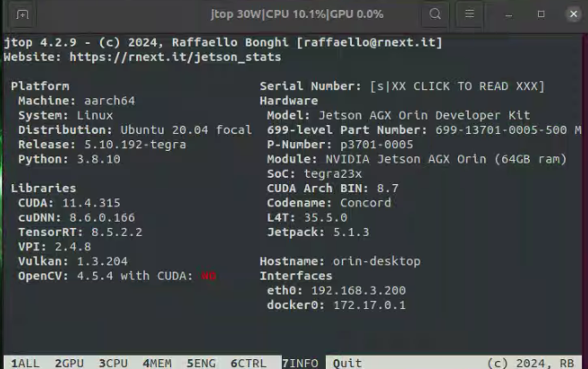
## Important Notes:

### 1. Industrial PC Issues:

#### 1.1 JetPack 6.0 (Ubuntu 22.04 - Humble) Version Issues:
a. Orin's built-in CUDA, cuDNN, and TensorRT components cannot be directly configured using the official automatic dependency installation commands.

b. Source compilation requires opencv_contrib libraries, which can only be manually compiled and installed with OpenCV. This process easily conflicts with the pre-installed Autoware.Universe environment, and resolving conflicts often leads to missing critical components, preventing Autoware from starting normally. See: https://github.com/silly-h/Fp_autoware_humble

c. Docker deployment gets stuck on the following command:
```
./setup-dev-env.sh -y docker
```
(Suspected to be caused by environment issues from compiling opencv_contrib on Orin)

#### 1.2 JetPack 5.3 (Ubuntu 20.04 - Galactic) Version Issues:
a. Orin's built-in CUDA, cuDNN, and TensorRT components cannot be directly configured using the official automatic dependency installation commands.

b. The official Docker version cannot properly call CUDA and related components on Ubuntu 20.04, so only source compilation deployment is considered for the 20.04 environment.

c. After source compilation on Orin, the official Autoware example simulation cannot plan paths normally. Solution reference in 3.2.4.

d. After source compilation on Orin, the path planning function only works normally on the first startup. Subsequent startups in the same terminal fail to plan paths. This can only be resolved by running in a new terminal.

### 2. Actual Vehicle Deployment Issues:

We are using Autoware.Universe-galactic version for actual vehicle deployment. The following issues were encountered during code debugging:

#### 2.1 Official Example Uses Multiple LiDAR Sensors:
- File location: `/autoware_universe/autoware/src/sensor_kit/sample_sensor_kit_launch/launch/pointcloud_preprocessor.launch.py`
- Original functionality: Multiple LiDAR point cloud stitching and output of corresponding topics and frame_id.
- Need to change functionality to point cloud cropping or directly change the topic and frame_id output of the LiDAR ROS driver.

#### 2.2 Inconsistent Input/Output Topics Between Nodes in Galactic Official Library:
- Mismatch between output topics from `/sensor_kit/sample_sensor_kit_launch/launch/pointcloud_preprocessor.launch.py` and input topics for `/autoware.universe/launch/tier4_localization_launch /localization.launch.xml`.
- These topics also inconsistent with the official pipeline.
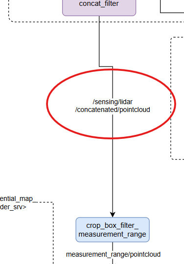
- Related issue: https://github.com/orgs/autowarefoundation/discussions/5018#discussioncomment-10319794

#### 2.3 Official MGRS Conversion Program Lacks Ubuntu 20.04 Version:
- When converting maps in Ubuntu 22.04 VM, point cloud map Z values are lost, causing subsequent NDT node errors.
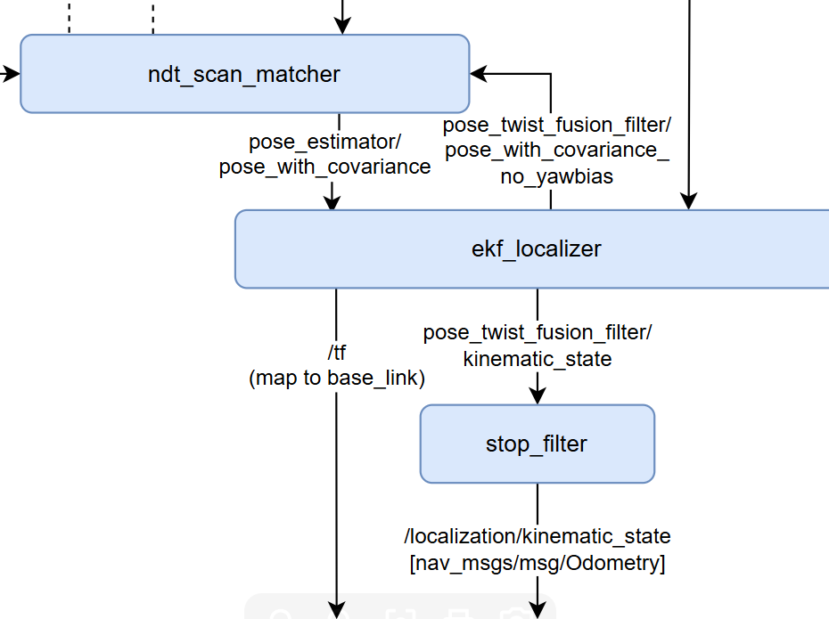
- Official guide: https://autowarefoundation.github.io/autoware-documentation/release-v1.0_beta/how-to-guides/integrating-autoware/creating-maps/converting-utm-to-mgrs-map/
- Suspected missing dependencies: geographiclib-get-geoids egm2008-1
- Related issue: https://github.com/orgs/autowarefoundation/discussions/5018#discussioncomment-10319794

#### 2.4 NDT Point Cloud Matching Fails with Official MGRS Converted Maps:
- Related issue: https://github.com/orgs/autowarefoundation/discussions/5128
- Point cloud map: https://drive.google.com/file/d/1P2wLHIvb0h-m4jg02DweaZlUPNVYATNo/view?usp=drive_link
- ROS2 bag: https://drive.google.com/file/d/1EHPwumBkZPWhBKyd227cgg51xsXqyM-Q/view?usp=drive_link

#### 2.5 Low TF Publishing Frequency for base_link and map:
- After normal NDT matching with local point cloud map, ekf_localizer's TF publishing node fails to work properly.
- Corresponding node input messages check normal.
- Point cloud map and ROS2 bag: https://drive.google.com/file/d/195AizfLdEGr24chBCs_HPLKDhs4ZEopS/view?usp=sharing
- Related issue: https://github.com/orgs/autowarefoundation/discussions/5018#discussioncomment-10319794

I. Flashing the Jetson Orin

1. Prepare a virtual machine with Ubuntu 20.04, set the virtual machine space to 80G.
2. Reference: https://gitee.com/plink718/plink-jetpack/tree/master/flashPatch/35.5.0/AGX-Orin/Y-C8
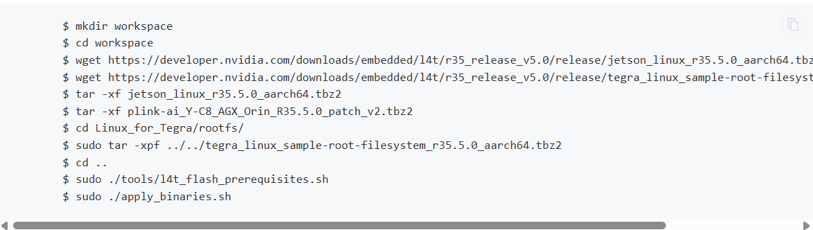
   (Note: The patch file name is different from the given command, you need to modify it yourself)
3. From here, to enter recovery mode, you must first connect the industrial computer's micro USB interface and then press and hold the REC button to enter recovery mode.
4. After successful writing, the computer will restart and black screen for a while, please wait.
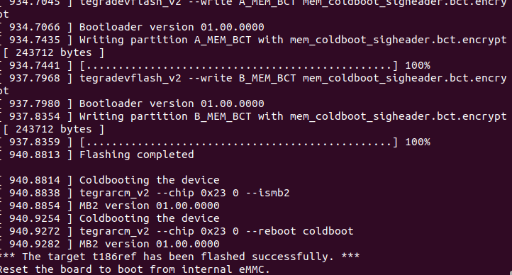

II. Mounting SSD to Home Directory

Reference: https://blog.csdn.net/qq_33232152/article/details/140341819
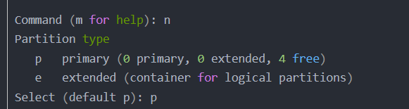
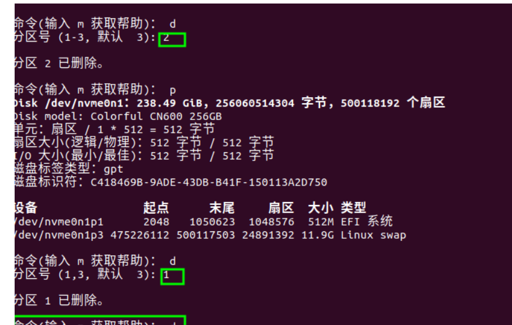
III. Changing System Sources

1. Use FishROS to change system sources. Command line:
   ```
   wget http://fishros.com/install -O fishros && . fishros
   ```
2. Select the source change command, do not clear third-party sources.

IV. Installing JetPack

1. Orin must use the CUDA, cuDNN, and tensorRT that come with the flashing, otherwise various .so symlink files will not be found. If JetPack cannot be installed in one click, it is recommended to reflash.

2. If unable to install after flashing, reference:
   https://blog.csdn.net/Black__Jacket/article/details/127736938
   (Note: This type of reason is due to deleting third-party sources when installing ROS using FishROS, please do not select!)

3. Dependency installation issues may occur:
   https://blog.csdn.net/m0_74116869/article/details/136608871
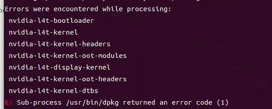

4. After the deep learning components like CUDA are installed, you can use jtop to click on the info at the bottom to check.


5. Jtop installation commands:
   ```
   sudo apt install python3-pip
   sudo -H pip3 install -U jetson-stats
   sudo systemctl restart jtop.service
   reboot
   ```

6. When configuring cuDNN, remember to modify the corresponding instructions according to the cuDNN version.


```
sudo ln -sf libcudnn.so.8.6.0 libcudnn.so.8
sudo ln -sf libcudnn_ops_train.so.8.6.0 libcudnn_ops_train.so.8
sudo ln -sf libcudnn_ops_infer.so.8.6.0 libcudnn_ops_infer.so.8
sudo ln -sf libcudnn_adv_train.so.8.6.0 libcudnn_adv_train.so.8
sudo ln -sf libcudnn_adv_infer.so.8.6.0 libcudnn_adv_infer.so.8
sudo ln -sf libcudnn_cnn_train.so.8.6.0 libcudnn_cnn_train.so.8
sudo ln -sf libcudnn_cnn_infer.so.8.6.0 libcudnn_cnn_infer.so.8
```

V. Installing ROS 2 and VSCode

1. Use FishROS to install ROS 2 Galactic in one click:
   ```
   wget http://fishros.com/install -O fishros && . fishros
   ```
   Follow the instructions to install, it is not recommended to clear third-party sources during the source change process.
   If you encounter issues with `ros2 bag`, try installing the necessary packages with the following command:

   ```bash
   sudo apt-get install ros-<distro>-ros2bag ros-<distro>-rosbag2*
   ```

3. Use FishROS to install VSCode in one click:
   ```
   wget http://fishros.com/install -O fishros && . fishros
   ```

VI. Enabling Orin's CAN Settings and Setting Auto-start

1. Install CAN dependencies:
   ```
   sudo apt-get install busybox can-utils
   ```

2. Test if CAN is connected:
   ```
   sudo busybox devmem 0x0c303018 w 0xc458
   sudo busybox devmem 0x0c303010 w 0xc400
   sudo busybox devmem 0x0c303008 w 0xc458
   sudo busybox devmem 0x0c303000 w 0xc400
   sudo modprobe can
   sudo modprobe can_raw
   sudo modprobe can_dev
   sudo modprobe mttcan
   sudo ip link set can0 type can bitrate 500000
   sudo ip link set can1 type can bitrate 500000
   sudo ip link set up can0
   sudo ip link set up can1
   ```

   Test CAN0/CAN1, if the terminal output shows connection (the chassis should be connected to CAN1):
   ```
   candump can0
   candump can1
   ```

3. Write the sh script in the final/can directory at the same level to auto-start:

   (1) Save the script as /usr/local/bin/setup_can.sh and grant execute permission:
       ```
       sudo mv setup_can.sh /usr/local/bin/setup_can.sh
       sudo chmod +x /usr/local/bin/setup_can.sh
       ```

   (2) Create a systemd service file:
       ```
       sudo gedit /etc/systemd/system/setup-can.service
       ```

   (3) Add the following content to this file:
       ```
       [Unit]
       Description=Setup CAN interfaces
       After=network.target

       [Service]
       Type=oneshot
       ExecStart=/usr/local/bin/setup_can.sh
       RemainAfterExit=yes

       [Install]
       WantedBy=multi-user.target
       ```

   (4) Save and close the file.

   (5) Reload the systemd manager configuration:
       ```
       sudo systemctl daemon-reload
       ```

   (6) Enable and start the service:
       ```
       sudo systemctl enable setup-can.service
       sudo systemctl start setup-can.service
       ```

VII. Installing Autoware.Universe from Source on Ubuntu 20.04 with ROS Galactic

References:
- https://blog.csdn.net/Akaxi1/article/details/136286150 (main)
- https://blog.csdn.net/zardforever123/article/details/132029636 (supplementary)

Compilation notes:
a. Be sure to put the source code in the /home directory, otherwise various rosdep errors will occur.
b. There will be version too low warning errors in the final compilation, modify in cmakelists, choose to ignore it.
c. Please do not install ROS1 and ROS2 in the environment at the same time, it will cause unpredictable problems.

1. Install VPN for git requirements, when configuring, change the network settings to manual and set:
   ```
   git config --global http.proxy 127.0.0.1:7890
   git config --global https.proxy 127.0.0.1:7890
   ```

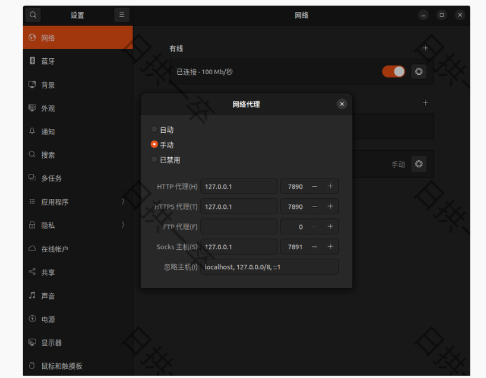
   When turning off VPN, input:
   ```
   git config --global --unset http.proxy
   git config --global --unset https.proxy
   ```

1. Installing dependencies
   (1) Install git:
       ```
       sudo apt-get -y update
       sudo apt-get -y install git
       ```

   (2) Clone Autoware locally:
       ```
       mkdir autoware_universe
       cd autoware_universe/
       git clone https://github.com/autowarefoundation/autoware.git -b galactic
       ```

   (3) Automatically install related dependencies:
       ```
       cd autoware
       ./setup-dev-env.sh
       ```
      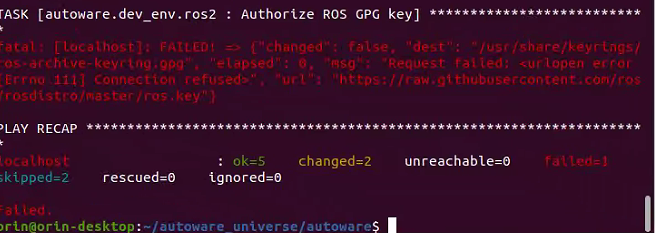
      This command will report an error, the following will be manually installed.

   (4) Install Ros2 dev tools:
       ```
       sudo apt install python3-testresources

       sudo apt update && sudo apt install -y \
         build-essential \
         cmake \
         git \
         python3-colcon-common-extensions \
         python3-flake8 \
         python3-pip \
         python3-pytest-cov \
         python3-rosdep \
         python3-setuptools \
         python3-vcstool \
         wget

       python3 -m pip install -U \
         flake8-blind-except \
         flake8-builtins \
         flake8-class-newline \
         flake8-comprehensions \
         flake8-deprecated \
         flake8-docstrings \
         flake8-import-order \
         flake8-quotes \
         pytest-repeat \
         pytest-rerunfailures \
         pytest \
         setuptools
       ```

   (5) Install rosdep:
       ```
       sudo rosdep init
       rosdep update
       ```

       If error occurs:

      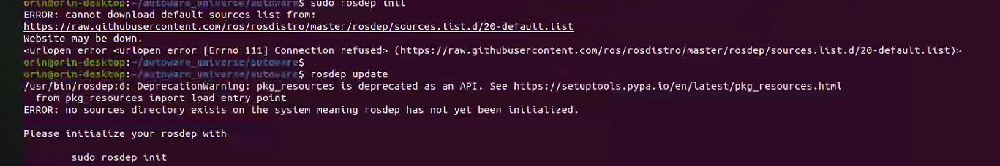
       ```
       # Manually simulate rosdep init
       sudo mkdir -p /etc/ros/rosdep/sources.list.d/
       sudo curl -o /etc/ros/rosdep/sources.list.d/20-default.list https://mirrors.tuna.tsinghua.edu.cn/github-raw/ros/rosdistro/master/rosdep/sources.list.d/20-default.list

       # Change source for rosdep update
       export ROSDISTRO_INDEX_URL=https://mirrors.tuna.tsinghua.edu.cn/rosdistro/index-v4.yaml
       # The following parameter is to not skip ROS versions
       rosdep update --include-eol-distros

       # Add this environment variable before each rosdep update
       # To persist this setting, you can write it to .bashrc, for example
       echo 'export ROSDISTRO_INDEX_URL=https://mirrors.tuna.tsinghua.edu.cn/rosdistro/index-v4.yaml' >> ~/.bashrc
       ```

   (6) Install RMW_Implementation (choose amd64.env instead of arm64.env, because arm64.env does not specify RMW_Implementation version):
       ```
       cd autoware
       source amd64.env
       sudo apt update
       rmw_implementation_dashed=$(eval sed -e "s/_/-/g" <<< "${rmw_implementation}")
       sudo apt install ros-${rosdistro}-${rmw_implementation_dashed}

       # (Optional) You set the default RMW implementation in the ~/.bashrc file.
       echo '' >> ~/.bashrc && echo "export RMW_IMPLEMENTATION=${rmw_implementation}" >> ~/.bashrc
       ```

   (7) Install pacmod (choose amd64.env instead of arm64.env, because arm64.env does not specify pacmod version):
       ```
       cd autoware
       source amd64.env
       sudo apt install apt-transport-https
       sudo sh -c 'echo "deb [trusted=yes] https://s3.amazonaws.com/autonomoustuff-repo/ $(lsb_release -sc) main" > /etc/apt/sources.list.d/autonomoustuff-public.list'
       sudo apt update
       sudo apt install ros-${rosdistro}-pacmod3
       ```

   (8) Install Autoware Core:
       ```
       pip3 install gdown
       ```

   (9) Install Autoware Universe dependencies:
       ```
       sudo apt install geographiclib-tools
       sudo geographiclib-get-geoids egm2008-1
       ```

   (10) Install pre-commit dependencies:
        ```
        clang_format_version=14.0.6
        pip3 install pre-commit clang-format==${clang_format_version}

        # Install Golang (Add Go PPA for shfmt)
        sudo add-apt-repository ppa:longsleep/golang-backports
        sudo apt install golang
        ```

3. Autoware Source Installation

   (1) Download Autoware.universe source code

       a. Create src folder
          ```
          cd autoware
          mkdir src
          ```

       b. Modify autoware.repos file
          ```
          sudo gedit autoware.repos
          ```
          Add the following content at line 28 in the autoware.repos file:
          ```
          universe/external/open_planner:
              type: git
              url: https://github.com/ZATiTech/open_planner.git
              version: main
          ```
          Note: Pay attention to alignment at the beginning

       c. Download code repository locally
          ```
          vcs import src < autoware.repos
          ```
          If the above doesn't work, enter the autoware folder, open the autoware.repos file, add a proxy to each URL in the file, add https://ghproxy.com/, as shown below:

   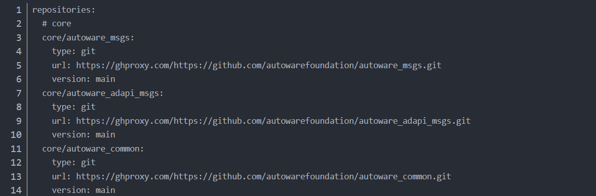

   (2) Install Autoware ROS dependency packages
       ```
       pip install --upgrade --user setuptools==58.3.0
       rosdep update --include-eol-distros
       source /opt/ros/galactic/setup.bash
       rosdep install -y --from-paths src --ignore-src --rosdistro $ROS_DISTRO
       ```
       (This command searches for ROS packages in the src directory to determine which system-level dependencies need to be installed. Then, it installs these dependencies through the operating system's package manager (e.g., apt).)

       If error occurs:
       ERROR: onnx-graphsurgeon 0.3.12 requires onnx, which is not installed.
       ERROR: flask 3.0.3 has requirement importlib-metadata>=3.6.0; python_version < "3.10", but you'll have importlib-metadata 1.5.0 which is incompatible.

       Solution:
       ```
       pip install onnx
       pip install --upgrade importlib-metadata
       ```

   (3) Compilation
       ```
       colcon build --symlink-install --cmake-args -DCMAKE_BUILD_TYPE=Release
       ```

       a. If error occurs:

      

          Solution:
          Add the following to line 3 of /autoware_universe/autoware/src/universe/autoware.universe/perception/traffic_light_classifier/CMakeLists.txt:
          ```
          set(CMAKE_CXX_FLAGS "${CMAKE_CXX_FLAGS} -Wno-deprecated-declarations")
          ```
          Add the same to line 3 of /autoware_universe/autoware/src/universe/autoware.universe/perception/traffic_light_ssd_fine_detector/CMakeLists.txt
          Add the same to line 3 of /autoware_universe/autoware/src/universe/autoware.universe/perception/tensorrt_yolo/CMakeLists.txt
          Add the following to line 3 of /autoware_universe/autoware/src/universe/autoware.universe/perception/lidar_centerpoint/CMakeLists.txt:
          ```
          add_compile_options(-Wno-error=deprecated-declarations)
          ```
          Add the following to line 3 of /autoware_universe/autoware/src/universe/autoware.universe/common/tensorrt_common/CMakeLists.txt:
          ```
          set(CMAKE_CXX_FLAGS "${CMAKE_CXX_FLAGS} -Wno-deprecated-declarations")
          ```

       b. If the map cannot be downloaded:

      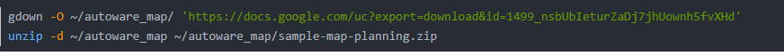
   
          Manually open the link to download

   (4) Run official example (initialization needs to wait for a while):
       ```
       cd autoware
       source install/setup.bash
       ros2 launch autoware_launch planning_simulator.launch.xml map_path:=$HOME/autoware_map/sample-map-planning vehicle_model:=sample_vehicle sensor_model:=sample_sensor_kit
       ```
      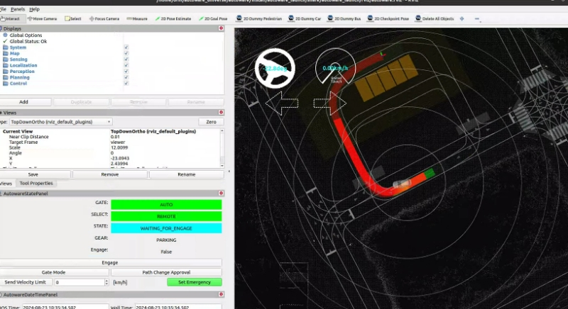

       The 20.04 galactic version has a problem with path planning, solution: https://blog.csdn.net/weixin_55800047/article/details/132146912
       ```
       echo 'export LD_PRELOAD=/usr/lib/aarch64-linux-gnu/libgomp.so.1' >> ~/.bashrc
       ```

VIII. Sensor ROS Driver Compilation and Testing

Modified repository address: https://github.com/silly-h/Fp_autoware_humble

1. Copy the sensor_driver file into /home/orin/autoware_universe/autoware/src
   After copying, please first install dependencies according to the corresponding driver instructions in 2 (only need to pay attention to camera driver dependencies, others can be directly copied for compilation).

2. Sensor driver sources:
   (1) Camera driver reference: https://docs.luxonis.com/software/ros/depthai-ros/build/

   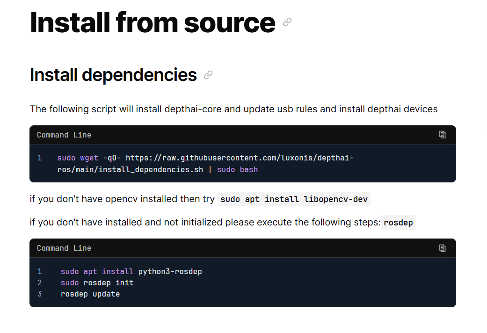
   
       Installing according to the official website command is slow: you can use the command
       ```
       sudo apt install ros-<distro>-depthai-ros
       ```
       to automatically install the corresponding dependencies and then compile from source

   (2) Sunglint chassis driver reference: https://github.com/agilexrobotics/scout_ros2/tree/humble
       Test commands:
       ```
       ros2 launch scout_base scout_base.launch.py
       ros2 run teleop_twist_keyboard teleop_twist_keyboard
       ```
       When testing the chassis driver, you need to turn on the remote control to control the car through the keyboard

   (3) rslidar driver reference: https://github.com/RoboSense-LiDAR/rslidar_sdk

   (4) fixposition-VRTK2 driver source: https://github.com/fixposition/fixposition_driver

4. Return to the /home/orin/autoware_universe/autoware folder for compilation:
   ```
   colcon build --symlink-install --cmake-args -DCMAKE_BUILD_TYPE=Release --packages-skip fixposition_driver_ros1 fixposition_odometry_converter_ros1
   ```
   This command cannot be prefixed with sudo, as sudo is a different environment. If you encounter permission problems during compilation, it may be caused by the copying process. It is recommended to download the source code for compilation according to the above driver references and make corresponding modifications by comparing the copied files.

5. How to modify the topics and frame_id of lidar, camera and RTK2 to specified topics and frame_id (this should correspond to the files in autoware_universe\autoware\src\sensor_kit\sample_sensor_kit_launch\sample_sensor_kit_description):
   sensor      topic                            frame_id
   lidar       /points                          velodyne_link
   imu         /fixposition/corr_imu            imu_link
   gps         /fixposition/nav_sat_fix         gnss_link
   camera      /color/image                     camera4/camera_link

   VRTK2/Imu:
   1. Directly change lines 33 and 50 in fixposition_driver_ros2/src/data_to_ros2.cpp to fixed frame_id
   2. Set lines 45 and 46 in fixposition_driver_ros2/src/fixpostion_driver_node.cpp to corresponding rostopic
   fixposition_driver_ros2 modification:
   Due to the publication of TF and TF_static causing conflicts with Autoware's TF topics, delete them:
   Method: Comment out lines 60, 61, 148-150, 190, 204 in fixposition_driver_ros2/src/fixpostion_driver_node

   camera:
   deptahi_examples/ros2_src/rgb_publisher: lines 49, 52

   lidar:
   rs_to_velodyne/src/rs_to_velodyne.cpp lines 97, 231

IX. Creating Sensor and Vehicle Models

Main reference: https://autowarefoundation.github.io/autoware-documentation/main/how-to-guides/

1. Creating sensor models:
   Main reference: https://autowarefoundation.github.io/autoware-documentation/main/how-to-guides/integrating-autoware/creating-vehicle-and-sensor-model/creating-vehicle-model/
   Main modification location: /autoware_universe/autoware/src/sensor_kit
   This repository address: https://github.com/silly-h/Fp_autoware_humble

   (1) /autoware_universe/autoware/src/sensor_kit/sample_sensor_kit_launch/sample_sensor_kit_description: This file is mainly used to set the extrinsic parameters between various sensors.
       IMU intrinsic calibration reference: https://blog.csdn.net/er_dan_love/article/details/124370788
       IMU-Lidar extrinsic calibration reference: https://blog.csdn.net/weixin_45205745/article/details/129462125
       The above calibration programs may not be applicable to ROS2 Galactic, please use a virtual machine and ROS2bag to ROS1bag for offline calibration according to your environment
       In the sensor_kit_calibration.yaml part, we chose the lidar as the base coordinate system of the sensor suite, so all extrinsic parameters between sensors are based on the lidar transformation.
       In the sensors_calibration.yaml part, the transformation from the sensor suite to the vehicle coordinate system is set (manually measured).

   (2) /autoware_universe/autoware/src/sensor_kit/sample_sensor_kit_launch/sample_sensor_kit_launch: This file is used to start various sensor drivers in the sensor_driver folder.
       Since VRTK2's gnss and imu are started together, only the gnss.launch.xml file is used to start gnss and imu related components. In addition, due to conflicts between drivers, we commented out the startup of fixposition_driver_ros2 in gnss.launch.xml, and chose to start fixposition_driver_ros2 separately before starting autoware.universe. gnss.launch.xml is only responsible for starting gnss and imu related components about autoware.
       pointcloud_preprocessor.launch.py: This part is different from Autoware's multi-lidar suite, we only use a single lidar solution. So we use the point cloud cropping function to replace the original point cloud stitching function, please modify this part according to the actual sensor equipment.

   (3) /autoware_universe/autoware/src/param/autoware_individual_params/individual_params/config/default/sample_sensor_kit: Make the same modifications as in 1.(1) in this folder

   (4) Compile this module:
       ```
       colcon build --symlink-install --cmake-args -DCMAKE_BUILD_TYPE=Release --packages-select sample_sensor_kit_description sample_sensor_kit_launch individual_params
       ```

2. Creating vehicle models:
   Main reference: https://autowarefoundation.github.io/autoware-documentation/main/how-to-guides/integrating-autoware/creating-vehicle-and-sensor-model/creating-vehicle-model/
   Main modification location: /autoware_universe/autoware/src/vehicle
   This repository address: https://github.com/silly-h/Fp_autoware_humble

   (1) /autoware_universe/autoware/src/vehicle/sample_vehicle_launch/sample_vehicle_description/config/mirror.param.yaml: This file is mainly used for point cloud cropping. If the vehicle does not have rearview mirrors, these values can be set to 0.0

   (2) /autoware_universe/autoware/src/vehicle/sample_vehicle_launch/sample_vehicle_description/config/vehicle_info.param.yaml:
       This file is mainly for vehicle physical dimension parameters, corresponding to the Sunglint car size interface: https://agilexrobotics.gitbook.io/scout_mini/6-chan-pin-chi-cun-product-dimensions

   (3) /autoware_universe/autoware/src/vehicle/sample_vehicle_launch/sample_vehicle_description/urdf/vehicle.xacro: This file is for vehicle model display in rviz, you can adjust the rpy and scaling in rviz, and adjust according to the actual situation.

   (4) /autoware_universe/autoware/src/vehicle/sample_vehicle_launch/sample_vehicle_launch/launch/vehicle_interface.launch.xml: Add chassis communication program in this file
       ```
       <include file="$(find-pkg-share can_communication)/launch/can_communication_launch.py"/>
       <include file="$(find-pkg-share scout_base)/launch/scout_base.launch.py"/>
       ```
       Reference: https://autowarefoundation.github.io/autoware-documentation/main/how-to-guides/integrating-autoware/creating-vehicle-interface-package/creating-vehicle-interface/
       Note: This chassis communication program can be found in the /autoware_universe/autoware/src/sensor_driver/driver folder. This program is only for simple control commands for Sunglint cars. For more control extensions, please write according to the officially provided interface.

   (5) Compile this module:
       ```
       colcon build --symlink-install --cmake-args -DCMAKE_BUILD_TYPE=Release --packages-select sample_vehicle_launch sample_vehicle_description
       ```

X. LiDAR-SLAM Mapping and MGRS Point Cloud Map Creation

Main reference: https://autowarefoundation.github.io/autoware-documentation/main/how-to-guides/integrating-autoware/creating-maps/

1. LiDAR-SLAM Mapping: Choose lio-sam for point cloud map construction, but VRTK2's built-in 6-axis IMU does not match the 9-axis IMU required by the algorithm. Choose the improved mapping algorithm: https://github.com/YJZLuckyBoy/liorf/tree/liorf-ros2
   When mapping, connect gnss to construct a local UTM map based on the East-North-Up coordinate system. If the coordinate system is successfully converted, the origin coordinate system will change after the mapping has been running for a while. When adapting the liorf algorithm to the VTRK2 driver, pay attention to modifying the gps_status part judgment. The modified code repository:
   https://github.com/silly-h/liorf_ros2

2. Official program deployment for UTM to MGRS map conversion:
   Reference: https://autowarefoundation.github.io/autoware-documentation/main/how-to-guides/integrating-autoware/creating-maps/converting-utm-to-mgrs-map/
   In addition to the tutorial configuration, you also need to modify line48/line49 in src:
   gnss_stat_utm.zone = 48; This sets the UTM (Universal Transverse Mercator) zone to 48.
   gnss_stat_utm.northup = true; This parameter indicates using the northern hemisphere UTM coordinate system.
   Please set these values according to your actual region.
   Note: The above environment requires Ubuntu 22.04 with ROS 2 Humble. Therefore, we have created a repository adapted for Ubuntu 20.04 with ROS 2 Galactic. The repository can be found at: https://github.com/silly-h/FP_pc_utm_to_mgrs_converter.git
Please follow the instructions in the repository README for configuration.

4. Drawing Lanelet2 map based on the created MGRS map:
   Reference: https://autowarefoundation.github.io/autoware-documentation/main/how-to-guides/integrating-autoware/creating-maps/creating-vector-map/
   Address: https://account.tier4.jp/login?flow=ac5b0de7-dea9-41a7-add2-8c9e74df2f28

5. Creating local map files
   Create a local map folder under the home/autoware_map folder, which contains four files, refer to the sample-map-planning folder at the same level
   Import the previously created .osm and .pcd files and rename them, set the map origin in map_config.yaml (mapping starting point, get reference soft/map/first.py), and change mgrs_grid in map_projector_info.yaml
   MGRS map number query: https://mgrs-mapper.com/app

XI. Autoware.Universe Source Code Modification for Local Adaptation

Autoware.Universe overall pipeline:
https://app.diagrams.net/?lightbox=1#Uhttps%3A%2F%2Fautowarefoundation.github.io%2Fautoware-documentation%2Fmain%2Fdesign%2Fautoware-architecture%2Fnode-diagram%2Foverall-node-diagram-autoware-universe.drawio.svg#%7B%22pageId%22%3A%22T6t2FfeAp1iw48vGkmOz%22%7D

1. Modify gnss_poser package to adapt to VRTK2 topic fixposition/navsat_fix data type
   Reason: VRTK2 can continue to output GPS signals when the gnss signal is lost or poor, but the status in the topic fixposition/navsat_fix reflects the actual gnss signal reception status.
   Modification location: /autoware_universe/autoware/src/universe/autoware.universe/sensing/gnss_poser/gnss_poser_core.cpp 
   Modification: Change line67 from const bool is_status_fixed = is_fixed(nav_sat_fix_msg_ptr->status); to const bool is_status_fixed = true; (This modification requires VRTK2 to be completely fixed before starting autoware)
   Compilation: 
   ```
   colcon build --symlink-install --cmake-args -DCMAKE_BUILD_TYPE=Release --packages-select gnss_poser
   ```

2. Corresponding to Autoware.universe's localization component part input topics
   Change line3 in /autoware_universe/autoware/src/universe/autoware.universe/launch/tier4_localization_launch/localization.launch.xml to: /sensing/lidar/concatenated/pointcloud

3. Modify input point cloud parameters to adapt to 16-line lidar
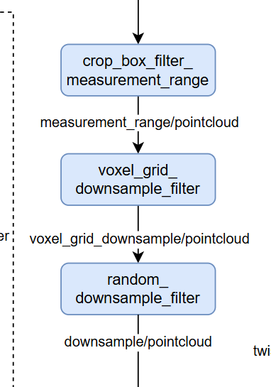

   Modification location: /autoware_universe/autoware/src/universe/autoware.universe/launch/tier4_localization_launch/config
   Reason for modification: The lidar model used is RS-16 lidar
   voxel_grid_filter.param.yaml: Corresponding to voxel sampling, all set to 0.1.
   random_downsample_filter.param.yaml: Corresponding to the number of sampling points, set to 3000.
   crop_box_filter_measurement_range.param.yaml: Corresponding to how large a range of point clouds to retain, keep unchanged.

5. Modify ndt_scan_matcher parameters
   Modification location: /autoware_universe/autoware/src/universe/autoware.universe/launch/tier4_localization_launch/config/ndt_scan_matcher.param.yaml
   Please modify according to the actual LiDAR model and point cloud map parameters.

6. Modify the lidar and IMU sensor messages input to ekf_localizer to ROS local time:
   Reason: In the ekf node, it determines the ekf by calculating the time difference between the system time and the time in the lidar header.stamp, but the lidar's current timing is inaccurate, consider using the system's time directly for subsequent topics.
   (1) Modification location: /autoware_universe/autoware/src/universe/autoware.universe/localization/ndt_scan_matcher/src/ndt_scan_matcher_core.cpp
       Modification: Change line318 from 
       const rclcpp::Time sensor_ros_time = sensor_points_sensorTF_msg_ptr->header.stamp;
       to
       const rclcpp::Time sensor_ros_time = this->now();
       Compilation: 
       ```
       colcon build --symlink-install --cmake-args -DCMAKE_BUILD_TYPE=Release --packages-select ndt_scan_matcher
       ```

   (2) Modification location: /autoware_universe/autoware/src/universe/autoware.universe/localization/gyro_odometer/src/gyro_odometer_core.cpp
       Modifications:
       Line106 change 
       twist.header.stamp = imu_msg_ptr_->header.stamp;
       to
       twist.header.stamp = this->now();
       line115 change
       twist_with_covariance.header.stamp = imu_msg_ptr_->header.stamp;
       to
       twist_with_covariance.header.stamp = this->now();
       line69 comment out return;
       line89 comment out return;
       Compilation: 
       ```
       colcon build --symlink-install --cmake-args -DCMAKE_BUILD_TYPE=Release --packages-select gyro_odometer
       ```
Certainly! Here is the English version formatted for a README file:

### XII. Real Vehicle Debugging

1 Startup Commands:

Due to the integration of the `fixposition_driver` and `can_communication` nodes into the Autoware launch process causing the processes to terminate, you need to start `fixposition_driver`, `can_communication`, and Autoware from three separate terminals. Use the following commands:

a. **In the first terminal:**
   ```bash
   source install/setup.bash
   ros2 launch can_communication can_communication_launch.py
   ```

b. **In the second terminal:**
   ```bash
   source install/setup.bash
   ros2 launch fixposition_driver_ros2 tcp_ros2.launch
   ```

c. **In the third terminal:**
   ```bash
   source install/setup.bash
   ros2 launch autoware_launch autoware.launch.xml map_path:=$HOME/autoware_map/fixposition-map-planning vehicle_model:=sample_vehicle sensor_model:=sample_sensor_kit
   ```
2、Using Fixposition VRTK2 with an MGRS point cloud map, it can quickly and accurately initialize the vehicle's position in indoor or GPS-weak environments.
[Autoware Indoor Video](https://www.youtube.com/watch?v=UaJr3nnXWWM)

---

# Autoware.Universe 部署问题及解决方案

## 硬件设置
- 工业PC：NVIDIA AGX ORIN 64G，配备 Plink 的 NVIDIA Jetson 系列扩展板
- 相机：OAK-D-Lite
- 激光雷达：RS-LIDAR-16
- GNSS/IMU：Fixposition VRTK2

## 软件环境
- Orin：JetPack 5.1.3/L4T 35.5.0
- Linux：Ubuntu 20.04
- ROS：ROS2-Galactic
- 架构：Arm64
- CUDA/cuDNN/TensorRT/OpenCV


## 重要注意事项

### 1. 工业PC问题

#### 1.1 JetPack 6.0（Ubuntu 22.04 - Humble）版本问题
a. Orin 内置的 CUDA、cuDNN 和 TensorRT 组件无法通过官方自动依赖安装命令直接配置。

b. 源码编译需要 opencv_contrib 库，这只能手动与 OpenCV 一起编译安装，此过程容易与预装的 Autoware.Universe 环境冲突，解决冲突时往往会导致缺少关键组件，Autoware 无法正常启动。详见：https://github.com/silly-h/Fp_autoware_humble

c. Docker 部署卡在以下命令上：

```bash
./setup-dev-env.sh -y docker
```

（怀疑是因为在 Orin 上编译 opencv_contrib 导致的环境问题）

#### 1.2 JetPack 5.3（Ubuntu 20.04 - Galactic）版本问题
a. Orin 内置的 CUDA、cuDNN 和 TensorRT 组件无法通过官方自动依赖安装命令直接配置。

b. 官方的 Docker 版本无法在 Ubuntu 20.04 上正常调用 CUDA 和相关组件，因此仅考虑在 20.04 环境中使用源码编译部署。

c. 在 Orin 上进行源码编译后，官方的 Autoware 示例仿真无法正常规划路径。解决方案参考 3.2.4。

d. 在 Orin 上源码编译后，路径规划功能仅在第一次启动时正常工作。在同一终端的后续启动中无法规划路径，只能通过在新终端中运行来解决。

### 2. 实车部署问题

我们在实车部署中使用 Autoware.Universe-galactic 版本，在代码调试过程中遇到以下问题：

#### 2.1 官方示例使用多个 LiDAR 传感器
- 文件位置：`/autoware_universe/autoware/src/sensor_kit/sample_sensor_kit_launch/launch/pointcloud_preprocessor.launch.py`
- 原功能：多个 LiDAR 点云拼接及输出对应的 topics 和 frame_id。
- 需更改为：点云裁剪，或者直接更改 LiDAR ROS 驱动的 topic 和 frame_id 输出。

#### 2.2 Galactic 官方库中各节点输入/输出 topic 不一致
- `/sensor_kit/sample_sensor_kit_launch/launch/pointcloud_preprocessor.launch.py` 中的输出 topics 与 `/autoware.universe/launch/tier4_localization_launch /localization.launch.xml` 的输入 topics 不一致。
- 与官方 pipeline 也不一致。


- 相关问题：https://github.com/orgs/autowarefoundation/discussions/5018#discussioncomment-10319794

#### 2.3 官方 MGRS 转换程序缺少 Ubuntu 20.04 版本
- 在 Ubuntu 22.04 虚拟机中转换地图时，点云地图 Z 值丢失，导致后续 NDT 节点报错。


- 官方指南：https://autowarefoundation.github.io/autoware-documentation/release-v1.0_beta/how-to-guides/integrating-autoware/creating-maps/converting-utm-to-mgrs-map/
- 怀疑缺少依赖：geographiclib-get-geoids egm2008-1
- 相关问题：https://github.com/orgs/autowarefoundation/discussions/5018#discussioncomment-10319794

#### 2.4 使用官方 MGRS 转换的地图时，NDT 点云匹配失败
- 相关问题：https://github.com/orgs/autowarefoundation/discussions/5128
- 点云地图：[点云地图下载链接](https://drive.google.com/file/d/1P2wLHIvb0h-m4jg02DweaZlUPNVYATNo/view?usp=drive_link)
- ROS2 包：[ROS2 包下载链接](https://drive.google.com/file/d/1EHPwumBkZPWhBKyd227cgg51xsXqyM-Q/view?usp=drive_link)

#### 2.5 base_link 和 map 的 TF 发布频率低
- 使用本地点云地图正常进行 NDT 匹配后，ekf_localizer 的 TF 发布节点无法正常工作。
- 对应节点输入消息检查正常。
- 点云地图和 ROS2 包：[下载链接](https://drive.google.com/file/d/195AizfLdEGr24chBCs_HPLKDhs4ZEopS/view?usp=sharing)
- 相关问题：https://github.com/orgs/autowarefoundation/discussions/5018#discussioncomment-10319794

---

### I. 刷写 Jetson Orin

1. 准备一个 Ubuntu 20.04 的虚拟机，将虚拟机空间设置为 80G。
2. 参考：[Jetson Orin 刷机补丁](https://gitee.com/plink718/plink-jetpack/tree/master/flashPatch/35.5.0/AGX-Orin/Y-C8)


   （注：补丁文件名与给定命令不同，需自行修改）
3. 从这里进入恢复模式，必须先连接工业电脑的 micro USB 接口，然后按住 REC 键进入恢复模式。
4. 写入成功后，计算机会重启并黑屏一会儿，请耐心等待。


### II. 挂载 SSD 到 Home 目录

参考：[挂载 SSD 参考链接](https://blog.csdn.net/qq_33232152/article/details/140341819)


### III. 更换系统源

1. 使用 FishROS 更换系统源。命令行：
   ```bash
   wget http://fishros.com/install -O fishros && . fishros
   ```
2. 选择更换源命令，不要清除第三方源。

### IV. 安装 JetPack

1. Orin 必须使用刷机自带的 CUDA、cuDNN 和 tensorRT，否则各种 .so 符号链接文件找不到。如不能一键安装 JetPack，建议重新刷机。

2. 若刷机后无法安装，参考：[JetPack 安装问题解决](https://blog.csdn.net/Black__Jacket/article/details/127736938)
   （注：此类原因是安装 ROS 时使用 FishROS 清除了第三方源，请勿选择！）

3. 依赖安装问题可能出现：[参考链接](https://blog.csdn.net/m0_74116869/article/details/136608871)


4. 安装深度学习组件（如 CUDA）后，可以使用 jtop 查看底部的信息。


5. Jtop 安装命令：
   ```bash
   sudo apt install python3-pip
   sudo -H pip3 install -U jetson-stats
   sudo systemctl restart jtop.service
   reboot
   ```

6. 配置 cuDNN 时，记得根据 cuDNN 版本修改对应指令。
   ```bash
   sudo ln -sf libcudnn.so.8.6.0 libcudnn.so.8
   sudo ln -sf libcudnn_ops_train.so.8.6.0 libcudnn_ops_train.so.8
   sudo ln -sf libcudnn_ops_infer.so.8.6.0 libcudnn_ops_infer.so.8
   sudo ln -sf libcudnn_adv_train.so.8.6.0 libcudnn_adv_train.so.8
   sudo ln -sf libcudnn_adv_infer.so.8.6.0 libcudnn_adv_infer.so.8
   sudo ln -sf libcudnn_cnn_train.so.8.6.0 libcudnn_cnn_train.so.8
   sudo ln -sf libcudnn_cnn_infer.so.8.6.0 libcudnn_cnn_infer.so.8
   ```

### V. 安装 ROS 2 和 VSCode

1. 使用 FishROS 一键安装 ROS 2 Galactic：
   ```bash
   wget http://fishros.com/install -O fishros && . fishros
   ```
   按照提示安装，在更换源的过程中不建议清除第三方源。
   
   如果使用 `ros2 bag` 时遇到问题，请尝试使用以下命令安装必要的包：
   
   ```bash
   sudo apt-get install ros-<distro>-ros2bag ros-<distro>-rosbag2*
   ```

3. 使用 FishROS 一键安装 VSCode：
   ```bash
   wget http://fishros.com/install -O fishros && . fishros
   ```

### VI. 开启 Orin 的 CAN 设置并设置自启动

1. 安装 CAN 依赖：
   ```bash
   sudo apt-get install busybox can-utils
   ```

2. 测试 CAN 是否连接：
   ```bash
   sudo busybox devmem 0x0c303018 w 0xc458
   sudo busybox devmem 0x0c303010 w 0xc400
   sudo busybox devmem 0x0c303008 w 0xc458
   sudo busybox devmem 0x0c303000 w 0xc400
   sudo modprobe can
   sudo modprobe can_raw
   sudo modprobe can_dev
   sudo modprobe mttcan
   sudo ip link set can0 type can bitrate 500000
   sudo ip link set can1 type can bitrate 500000
   sudo ip link set up can0
   sudo ip link set up can1
   ```
   测试 CAN0/CAN1，如终端输出显示连接（底盘应接 CAN1）：
   ```bash
   candump can0
   candump can1
   ```

3. 在同级 final/can 目录下编写 sh 脚本实现自启动：

   (1) 将脚本保存为 /usr/local/bin/setup_can.sh 并授予执行权限：
       ```bash
       sudo mv setup_can.sh /usr/local/bin/setup_can.sh
       sudo chmod +x /usr/local/bin/setup_can.sh
       ```

   (2) 创建 systemd 服务文件：
       ```bash
       sudo gedit /etc/systemd/system/setup-can.service
       ```

   (3) 在此文件中添加以下内容：
       ```bash
       [Unit]
       Description=Setup CAN interfaces
       After=network.target

       [Service]
       Type=oneshot
       ExecStart=/usr/local/bin/setup_can.sh
       RemainAfterExit=yes

       [Install]
       WantedBy=multi-user.target
       ```

   (4) 保存并关闭文件。

   (5) 重新加载 systemd 管理器配置：
       ```bash
       sudo systemctl daemon-reload
       ```

   (6) 启用并启动服务：
       ```bash
       sudo systemctl enable setup-can.service
       sudo systemctl start setup-can.service
       ```

### VII. 在 Ubuntu 20.04 上从源代码安装 Autoware.Universe 并运行 ROS Galactic

参考资料：
- [主要参考](https://blog.csdn.net/Akaxi1/article/details/136286150)
- [补充参考](https://blog.csdn.net/zardforever123/article/details/132029636)

编译注意事项：
a. 请务必将源代码放在 `/home` 目录中，否则会出现各种 rosdep 错误。
b. 最终编译会有版本过低的警告错误，在 `CMakeLists.txt` 中进行修改，选择忽略即可。
c. 请勿在同一环境中安装 ROS1 和 ROS2，这会导致不可预见的问题。

1. 安装 VPN 以满足 git 需求，配置时更改网络设置为手动并设置：
   ```bash
   git config --global http.proxy 127.0.0.1:7890
   git config --global https.proxy 127.0.0.1:7890
   ```
   关闭 VPN 时输入：
   ```bash
   git config --global --unset http.proxy
   git config --global --unset https.proxy
   ```

2. 安装依赖

   (1) 安装 git：
       ```bash
       sudo apt-get -y update
       sudo apt-get -y install git
       ```

   (2) 本地克隆 Autoware：
       ```bash
       mkdir autoware_universe
       cd autoware_universe/
       git clone https://github.com/autowarefoundation/autoware.git -b galactic
       ```

   (3) 自动安装相关依赖：
       ```bash
       cd autoware
       ./setup-dev-env.sh
       ```
       该命令可能会报错，下面将手动安装。

   (4) 安装 ROS 2 开发工具：
       ```bash
       sudo apt install python3-testresources

       sudo apt update && sudo apt install -y \
         build-essential \
         cmake \
         git \
         python3-colcon-common-extensions \
         python3-flake8 \
         python3-pip \
         python3-pytest-cov \
         python3-rosdep \
         python3-setuptools \
         python3-vcstool \
         wget

       python3 -m pip install -U \
         flake8-blind-except \
         flake8-builtins \
         flake8-class-newline \
         flake8-comprehensions \
         flake8-deprecated \
         flake8-docstrings \
         flake8-import-order \
         flake8-quotes \
         pytest-repeat \
         pytest-rerunfailures \
         pytest \
         setuptools
       ```

   (5) 安装 rosdep：
       ```bash
       sudo rosdep init
       rosdep update
       ```
       如果出现错误，可以手动模拟 rosdep init：
       ```bash
       # 手动模拟 rosdep init
       sudo mkdir -p /etc/ros/rosdep/sources.list.d/
       sudo curl -o /etc/ros/rosdep/sources.list.d/20-default.list https://mirrors.tuna.tsinghua.edu.cn/github-raw/ros/rosdistro/master/rosdep/sources.list.d/20-default.list

       # 更改 rosdep update 的源
       export ROSDISTRO_INDEX_URL=https://mirrors.tuna.tsinghua.edu.cn/rosdistro/index-v4.yaml
       # 下面的参数是为了不跳过 ROS 版本
       rosdep update --include-eol-distros

       # 在每次 rosdep update 之前添加这个环境变量
       # 为了使这个设置持久化，可以将其写入 .bashrc 中，例如
       echo 'export ROSDISTRO_INDEX_URL=https://mirrors.tuna.tsinghua.edu.cn/rosdistro/index-v4.yaml' >> ~/.bashrc
       ```

   (6) 安装 RMW_Implementation（选择 `amd64.env` 而非 `arm64.env`，因为 `arm64.env` 未指定 RMW_Implementation 版本）：
       ```bash
       cd autoware
       source amd64.env
       sudo apt update
       rmw_implementation_dashed=$(eval sed -e "s/_/-/g" <<< "${rmw_implementation}")
       sudo apt install ros-${rosdistro}-${rmw_implementation_dashed}

       #（可选）你可以在 ~/.bashrc 文件中设置默认的 RMW 实现。
       echo '' >> ~/.bashrc && echo "export RMW_IMPLEMENTATION=${rmw_implementation}" >> ~/.bashrc
       ```

   (7) 安装 pacmod（选择 `amd64.env` 而非 `arm64.env`，因为 `arm64.env` 未指定 pacmod 版本）：
       ```bash
       cd autoware
       source amd64.env
       sudo apt install apt-transport-https
       sudo sh -c 'echo "deb [trusted=yes] https://s3.amazonaws.com/autonomoustuff-repo/ $(lsb_release -sc) main" > /etc/apt/sources.list.d/autonomoustuff-public.list'
       sudo apt update
       sudo apt install ros-${rosdistro}-pacmod3
       ```

   (8) 安装 Autoware Core：
       ```bash
       pip3 install gdown
       ```

   (9) 安装 Autoware Universe 依赖：
       ```bash
       sudo apt install geographiclib-tools
       sudo geographiclib-get-geoids egm2008-1
       ```

   (10) 安装 pre-commit 依赖：
        ```bash
        clang_format_version=14.0.6
        pip3 install pre-commit clang-format==${clang_format_version}

        # 安装 Golang（添加 Go PPA 以支持 shfmt）
        sudo add-apt-repository ppa:longsleep/golang-backports
        sudo apt install golang
        ```

3. Autoware 源代码安装

   (1) 下载 Autoware.universe 源代码

       a. 创建 src 文件夹
          ```bash
          cd autoware
          mkdir src
          ```

       b. 修改 `autoware.repos` 文件
          ```bash
          sudo gedit autoware.repos
          ```
          在 `autoware.repos` 文件的第 28 行添加以下内容：
          ```yaml
          universe/external/open_planner:
              type: git
              url: https://github.com/ZATiTech/open_planner.git
              version: main
          ```
          注意：开头对齐

       c. 本地下载代码库
          ```bash
          vcs import src < autoware.repos
          ```
          如果以上无法工作，进入 `autoware` 文件夹，打开 `autoware.repos` 文件，在文件中的每个 URL 前添加代理，加上 `https://ghproxy.com/`，如下所示：

   

   (2) 安装 Autoware ROS 依赖包
       ```bash
       pip install --upgrade --user setuptools==58.3.0
       rosdep update --include-eol-distros
       source /opt/ros/galactic/setup.bash
       rosdep install -y --from-paths src --ignore-src --rosdistro $ROS_DISTRO
       ```
       （此命令在 `src` 目录中搜索 ROS 包，以确定需要安装哪些系统级依赖项。然后，通过操作系统的包管理器（例如 apt）来安装这些依赖项。）

       如果出现错误：
       ```
       ERROR: onnx-graphsurgeon 0.3.12 requires onnx, which is not installed.
       ERROR: flask 3.0.3 has requirement importlib-metadata>=3.6.0; python_version < "3.10", but you'll have importlib-metadata 1.5.0 which is incompatible.
       ```

       解决方案：
       ```bash
       pip install onnx
       pip install --upgrade importlib-metadata
       ```

   (3) 编译
       ```bash
       colcon build --symlink-install --cmake-args -DCMAKE_BUILD_TYPE=Release
       ```

       a. 如果出现错误：

      

          解决方案：
          在 `/autoware_universe/autoware/src/universe/autoware.universe/perception/traffic_light_classifier/CMakeLists.txt` 的第 3 行添加：
          ```cmake
          set(CMAKE_CXX_FLAGS "${CMAKE_CXX_FLAGS} -Wno-deprecated-declarations")
          ```
          在 `/autoware_universe/autoware/src/universe/autoware.universe/perception/traffic_light_ssd_fine_detector/CMakeLists.txt` 的第 3 行添加相同内容。
          在 `/autoware_universe/autoware/src/universe/autoware.universe/perception/tensorrt_yolo/CMakeLists.txt` 的第 3 行添加相同内容。
          在 `/autoware_universe/autoware/src/universe/autoware.universe/perception/lidar_centerpoint/CMakeLists.txt` 的第 3 行添加：
          ```cmake
          add_compile_options(-Wno-error=deprecated-declarations)
          ```
          在 `/autoware_universe/autoware/src/universe/autoware.universe/common/tensorrt_common/CMakeLists.txt` 的第 3 行添加：
          ```cmake
          set(CMAKE_CXX_FLAGS "${CMAKE_CXX_FLAGS} -Wno-deprecated-declarations")
          ```

       b. 如果地图无法下载：

      
   
          手动打开链接下载

   (4) 运行官方示例（初始化需要等待一段时间）：
       ```bash
       cd autoware
       source install/setup.bash
       ros2 launch autoware_launch planning_simulator.launch.xml map_path:=$HOME/autoware_map/sample-map-planning vehicle_model:=sample_vehicle sensor_model:=sample_sensor_kit
       ```
      

       20.04 galactic 版本在路径规划上存在问题，解决方案：[路径规划问题解决](https://blog.csdn.net/weixin_55800047/article/details/132146912)
       ```bash
       echo 'export LD_PRELOAD=/usr/lib/aarch64-linux-gnu/libgomp.so.1' >> ~/.bashrc
       ```

### VIII. 传感器 ROS 驱动编译与测试

修改后的仓库地址：[GitHub仓库](https://github.com/silly-h/Fp_autoware_humble)

1. 将 `sensor_driver` 文件复制到 `/home/orin/autoware_universe/autoware/src`
   复制后，请根据第 2 节中对应的驱动指令安装依赖项（只需注意相机驱动依赖项，其他的可以直接复制编译）。

2. 传感器驱动源码：
   (1) 相机驱动参考：[相机驱动](https://docs.luxonis.com/software/ros/depthai-ros/build/)

   

       按照官网命令安装较慢：可以使用命令
       ```bash
       sudo apt install ros-<distro>-depthai-ros
       ```
       自动安装相应依赖后再进行源码编译

   (2) 上凌底盘驱动参考：[上凌底盘驱动](https://github.com/agilexrobotics/scout_ros2/tree/humble)
       测试命令：
       ```bash
       ros2 launch scout_base scout_base.launch.py
       ros2 run teleop_twist_keyboard teleop_twist_keyboard
       ```
       测试底盘驱动时，需要打开遥控，通过键盘控制车

   (3) rslidar 驱动参考：[rslidar 驱动](https://github.com/RoboSense-LiDAR/rslidar_sdk)

   (4) fixposition-VRTK2 驱动源码：[fixposition-VRTK2 驱动](https://github.com/fixposition/fixposition_driver)

4. 回到 `/home/orin/autoware_universe/autoware` 文件夹进行编译：
   ```bash
   colcon build --symlink-install --cmake-args -DCMAKE_BUILD_TYPE=Release --packages-skip fixposition_driver_ros1 fixposition_odometry_converter_ros1
   ```
   此命令前不能加 `sudo`，因为 `sudo` 是不同的环境。如编译中遇到权限问题，可能是因为拷贝过程造成的，建议按照上述驱动参考下载源码进行编译，并通过对比已拷贝文件进行相应修改。

5. 如何将 lidar、camera 和 RTK2 的 topics 和 frame_id 修改为指定的 topics 和 frame_id（对应在 `autoware_universe/autoware/src/sensor_kit/sample_sensor_kit_launch/sample_sensor_kit_description` 中的文件）：

| 传感器 | topic                          | frame_id          |
|--------|--------------------------------|-------------------|
| lidar  | /points                        | velodyne_link     |
| imu    | /fixposition/corr_imu          | imu_link          |
| gps    | /fixposition/nav_sat_fix       | gnss_link         |
| camera | /color/image                   | camera4/camera_link |

   **VRTK2/IMU:**
   1. 直接将 `fixposition_driver_ros2/src/data_to_ros2.cpp` 中的第 33 行和第 50 行修改为固定的 `frame_id`
   2. 将 `fixposition_driver_ros2/src/fixpostion_driver_node.cpp` 中的第 45 行和第 46 行设置为相应的 `rostopic`
   
   fixposition_driver_ros2 修改：
   由于 `TF` 和 `TF_static` 的发布会与 Autoware 的 `TF topics` 冲突，删除这些发布：
   方法：注释掉 `fixposition_driver_ros2/src/fixpostion_driver_node` 中的第 60、61、148-150、190、204 行

   **camera:**
   `deptahi_examples/ros2_src/rgb_publisher`: 第 49、52 行

   **lidar:**
   `rs_to_velodyne/src/rs_to_velodyne.cpp` 第 97、231 行

### IX. 创建传感器与车辆模型

主要参考：[传感器与车辆模型创建](https://autowarefoundation.github.io/autoware-documentation/main/how-to-guides/)

1. 创建传感器模型：
   主要参考：[创建传感器模型](https://autowarefoundation.github.io/autoware-documentation/main/how-to-guides/integrating-autoware/creating-vehicle-and-sensor-model/creating-vehicle-model/)
   主要修改位置：`/autoware_universe/autoware/src/sensor_kit`
   此仓库地址：[GitHub仓库](https://github.com/silly-h/Fp_autoware_humble)

   (1) `/autoware_universe/autoware/src/sensor_kit/sample_sensor_kit_launch/sample_sensor_kit_description`: 该文件主要用于设置各传感器之间的外参。
       - **IMU 内参标定参考**：[IMU 内参标定](https://blog.csdn.net/er_dan_love/article/details/124370788)
       - **IMU-Lidar 外参标定参考**：[IMU-Lidar 外参标定](https://blog.csdn.net/weixin_45205745/article/details/129462125)

       上述标定程序可能不适用于 ROS2 Galactic，请使用虚拟机和 ROS2bag 转 ROS1bag 进行离线标定根据您的环境进行标定。

       在 `sensor_kit_calibration.yaml` 部分，我们选择以 lidar 作为传感器套件的基坐标系，因此所有传感器之间的外参均基于 lidar 的转换。
       
       在 `sensors_calibration.yaml` 部分，设置了传感器套件到车辆坐标系的转换（手动测量）。

   (2) `/autoware_universe/autoware/src/sensor_kit/sample_sensor_kit_launch/sample_sensor_kit_launch`: 此文件用于启动 `sensor_driver` 文件夹中的各传感器驱动。

       由于 VRTK2 的 gnss 和 imu 一起启动，因此仅使用 `gnss.launch.xml` 文件来启动 gnss 和 imu 相关组件。此外，由于驱动冲突，我们注释掉了 `gnss.launch.xml` 中 `fixposition_driver_ros2` 的启动，选择在启动 `autoware.universe` 之前单独启动 `fixposition_driver_ros2`。`gnss.launch.xml` 仅负责启动关于 autoware 的 gnss 和 imu 相关组件。

       `pointcloud_preprocessor.launch.py`: 此部分不同于 Autoware 的多激光雷达套件，我们仅使用单一激光雷达方案。因此我们使用点云裁剪功能替代原有的点云拼接功能，请根据实际传感器设备修改此部分。

   (3) `/autoware_universe/autoware/src/param/autoware_individual_params/individual_params/config/default/sample_sensor_kit`: 在此文件夹中进行与 1.(1) 中相同的修改

   (4) 编译该模块：
       ```bash
       colcon build --symlink-install --cmake-args -DCMAKE_BUILD_TYPE=Release --packages-select sample_sensor_kit_description sample_sensor_kit_launch individual_params
       ```

2. 创建车辆模型：
   主要参考：[创建车辆模型](https://autowarefoundation.github.io/autoware-documentation/main/how-to-guides/integrating-autoware/creating-vehicle-and-sensor-model/creating-vehicle-model/)
   主要修改位置：`/autoware_universe/autoware/src/vehicle`
   此仓库地址：[GitHub仓库](https://github.com/silly-h/Fp_autoware_humble)

   (1) `/autoware_universe/autoware/src/vehicle/sample_vehicle_launch/sample_vehicle_description/config/mirror.param.yaml`: 该文件主要用于点云裁剪。如果车辆没有后视镜，可以将这些值设置为 0.0

   (2) `/autoware_universe/autoware/src/vehicle/sample_vehicle_launch/sample_vehicle_description/config/vehicle_info.param.yaml`:
       该文件主要用于车辆物理尺寸参数，对应上凌车尺寸接口：[上凌车尺寸接口](https://agilexrobotics.gitbook.io/scout_mini/6-chan-pin-chi-cun-product-dimensions)

   (3) `/autoware_universe/autoware/src/vehicle/sample_vehicle_launch/sample_vehicle_description/urdf/vehicle.xacro`: 该文件用于 rviz 中的车辆模型显示，可以在 rviz 中调整 rpy 和缩放比例，并根据实际情况进行调整。

   (4) `/autoware_universe/autoware/src/vehicle/sample_vehicle_launch/sample_vehicle_launch/launch/vehicle_interface.launch.xml`: 在此文件中添加底盘通信程序
       ```xml
       <include file="$(find-pkg-share can_communication)/launch/can_communication_launch.py"/>
       <include file="$(find-pkg-share scout_base)/launch/scout_base.launch.py"/>
       ```
       参考：[底盘通信程序](https://autowarefoundation.github.io/autoware-documentation/main/how-to-guides/integrating-autoware/creating-vehicle-interface-package/creating-vehicle-interface/)
       
       注：此底盘通信程序在 `/autoware_universe/autoware/src/sensor_driver/driver` 文件夹中可找到。此程序仅用于简单控制命令的上凌车，更多控制扩展请根据官方提供的接口进行编写。

   (5) 编译该模块：
       ```bash
       colcon build --symlink-install --cmake-args -DCMAKE_BUILD_TYPE=Release --packages-select sample_vehicle_launch sample_vehicle_description
       ```

### X. LiDAR-SLAM 建图与 MGRS 点云地图创建

主要参考：[点云地图创建](https://autowarefoundation.github.io/autoware-documentation/main/how-to-guides/integrating-autoware/creating-maps/)

1. **LiDAR-SLAM 建图**：选择 lio-sam 进行点云地图构建，但 VRTK2 内置的 6 轴 IMU 与算法要求的 9 轴 IMU 不匹配。选择改进的建图算法：[改进的建图算法](https://github.com/YJZLuckyBoy/liorf/tree/liorf-ros2)

   建图时连接 gnss 以构建基于东-北-上坐标系的本地 UTM 地图。如坐标系成功转换，则建图运行一段时间后原点坐标系会发生变化。在适配 liorf 算法到 VTRK2 驱动时，请注意修改 gps_status 部分的判断。修改后的代码仓库：[修改后的代码仓库](https://github.com/silly-h/liorf_ros2)

2. **官方程序部署用于 UTM 到 MGRS 地图转换**：
   参考：[UTM 到 MGRS 地图转换](https://autowarefoundation.github.io/autoware-documentation/main/how-to-guides/integrating-autoware/creating-maps/converting-utm-to-mgrs-map/)
   
   除教程配置外，还需修改 `src` 中的 `line48/line49`：
   ```cpp
   gnss_stat_utm.zone = 48; // 这设置了 UTM（通用横轴墨卡托）区域为 48。
   gnss_stat_utm.northup = true; // 此参数表示使用北半球的 UTM 坐标系。
   ```
   请根据您的实际地区设置这些值。
   注意：上述环境需求为 Ubuntu 22.04 和 ROS 2 Humble。为此，我们创建了一个适配 Ubuntu 20.04 和 ROS 2 Galactic 版本的仓库，地址为：https://github.com/silly-h/FP_pc_utm_to_mgrs_converter.git
   请根据仓库中的 README 文件进行配置。


4. **基于创建的 MGRS 地图绘制 Lanelet2 地图**：
   参考：[Lanelet2 地图绘制](https://autowarefoundation.github.io/autoware-documentation/main/how-to-guides/integrating-autoware/creating-maps/creating-vector-map/)
   
   地址：[Lanelet2 地图地址](https://account.tier4.jp/login?flow=ac5b0de7-dea9-41a7-add2-8c9e74df2f28)

5. **创建本地地图文件**
   在 `home/autoware_map` 文件夹下创建 `local map` 文件夹，包含四个文件，参考同级 `sample-map-planning` 文件夹
   
   导入之前创建的 `.osm` 和 `.pcd` 文件并重命名，在 `map_config.yaml` 中设置地图原点（建图起点，获取参考 `soft/map/first.py`），更改 `map_projector_info.yaml` 中的 `mgrs_grid`
   
   MGRS 地图号查询：[MGRS 地图号查询](https://mgrs-mapper.com/app)

### XI. Autoware.Universe 源代码本地适配修改

Autoware.Universe 整体 pipeline：[整体 pipeline 图示](https://app.diagrams.net/?lightbox=1#Uhttps%3A%2F%2Fautowarefoundation.github.io%2Fautoware-documentation%2Fmain%2Fdesign%2Fautoware-architecture%2Fnode-diagram%2Foverall-node-diagram-autoware-universe.drawio.svg#%7B%22pageId%22%3A%22T6t2FfeAp1iw48vGkmOz%22%7D)

1. **修改 gnss_poser 包以适应 VRTK2 topic `fixposition/navsat_fix` 数据类型**

   **原因**：VRTK2 在 gnss 信号丢失或差时可以继续输出 GPS 信号，但 topic `fixposition/navsat_fix` 中的 `status` 反映了实际 gnss 信号接收情况。
   
   **修改位置**：`/autoware_universe/autoware/src/universe/autoware.universe/sensing/gnss_poser/gnss_poser_core.cpp`
   
   **修改**：将第 67 行从 
   ```cpp
   const bool is_status_fixed = is_fixed(nav_sat_fix_msg_ptr->status);
   ```
   改为 
   ```cpp
   const bool is_status_fixed = true;
   ```
   （此修改需要 VRTK2 完全 fix 后再启动 autoware）
   
   **编译**： 
   ```bash
   colcon build --symlink-install --cmake-args -DCMAKE_BUILD_TYPE=Release --packages-select gnss_poser
   ```

2. **对应 Autoware.universe 的 localization 组件部分输入 topics**
   
   **修改**：将 `/autoware_universe/autoware/src/universe/autoware.universe/launch/tier4_localization_launch/localization.launch.xml` 的第 3 行修改为：
   ```xml
   /sensing/lidar/concatenated/pointcloud
   ```

3. **修改输入点云参数以适应 16 线激光雷达**

   **修改位置**：`/autoware_universe/autoware/src/universe/autoware.universe/launch/tier4_localization_launch/config`
   
   **修改原因**：使用的激光雷达型号为 RS-16 lidar
   
   - `voxel_grid_filter.param.yaml`：对应体素采样，均设置为 0.1。
   - `random_downsample_filter.param.yaml`：对应采样点数，设置为 3000。
   - `crop_box_filter_measurement_range.param.yaml`：对应保留点云的范围大小，保持不变。

4. **修改 ndt_scan_matcher 参数**

   **修改位置**：`/autoware_universe/autoware/src/universe/autoware.universe/launch/tier4_localization_launch/config/ndt_scan_matcher.param.yaml`
   
   请根据实际激光雷达型号和点云地图参数进行修改。


5. **修改 ekf_localizer 中激光雷达和 IMU 传感器消息的输入为 ROS 本地时间**
   
   **原因**：在 `ekf` 节点中通过计算系统时间与激光雷达 `header.stamp` 中的时间差来确定 `ekf`，但激光雷达目前的时间测量不准确，考虑使用系统的时间直接作为后续 topics 的时间。
   
   1. **修改位置**：`/autoware_universe/autoware/src/universe/autoware.universe/localization/ndt_scan_matcher/src/ndt_scan_matcher_core.cpp`
      
      **修改**：将第 318 行从 
      ```cpp
      const rclcpp::Time sensor_ros_time = sensor_points_sensorTF_msg_ptr->header.stamp;
      ```
      改为
      ```cpp
      const rclcpp::Time sensor_ros_time = this->now();
      ```
      **编译**： 
      ```bash
      colcon build --symlink-install --cmake-args -DCMAKE_BUILD_TYPE=Release --packages-select ndt_scan_matcher
      ```

   2. **修改位置**：`/autoware_universe/autoware/src/universe/autoware.universe/localization/gyro_odometer/src/gyro_odometer_core.cpp`
      
      **修改**：
      - 第 106 行将 
      ```cpp
      twist.header.stamp = imu_msg_ptr_->header.stamp;
      ```
      改为
      ```cpp
      twist.header.stamp = this->now();
      ```
      - 第 115 行将
      ```cpp
      twist_with_covariance.header.stamp = imu_msg_ptr_->header.stamp;
      ```
      改为
      ```cpp
      twist_with_covariance.header.stamp = this->now();
      ```
      - 第 69 行注释掉 `return;`
      - 第 89 行注释掉 `return;`
      
      **编译**： 
      ```bash
      colcon build --symlink-install --cmake-args -DCMAKE_BUILD_TYPE=Release --packages-select gyro_odometer
      ```
当然，以下是中文版本的 README 格式：

---

### XII. 实车调试

1 启动命令：

由于 `fixposition_driver` 和 `can_communication` 节点在集成到 Autoware 启动过程中会导致进程终止，因此需要分别在三个终端中启动 `fixposition_driver`、`can_communication` 和 Autoware。使用以下命令：

a. **在第一个终端中：**
   ```bash
   source install/setup.bash
   ros2 launch can_communication can_communication_launch.py
   ```

b. **在第二个终端中：**
   ```bash
   source install/setup.bash
   ros2 launch fixposition_driver_ros2 tcp_ros2.launch
   ```

c. **在第三个终端中：**
   ```bash
   source install/setup.bash
   ros2 launch autoware_launch autoware.launch.xml map_path:=$HOME/autoware_map/fixposition-map-planning vehicle_model:=sample_vehicle sensor_model:=sample_sensor_kit
   ```
2、使用fixpositon VRTK2在MGRS点云地图下，在室内等GPS较弱环境下能够快速准确初始化小车位置。
[Autoware Indoor Video](https://www.youtube.com/watch?v=UaJr3nnXWWM)


