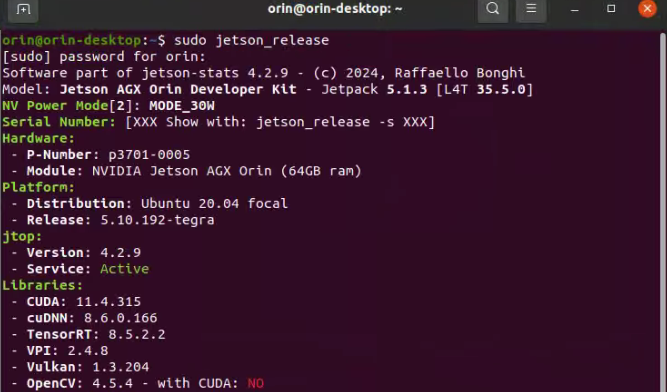
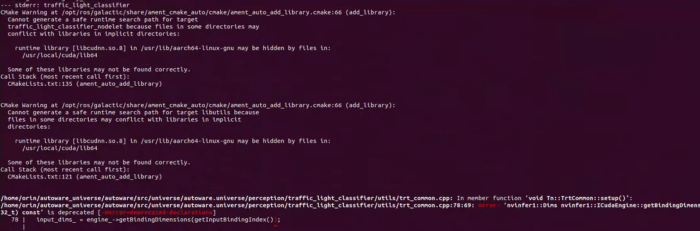

# Autoware.Universe Deployment Issues and Solutions

## Hardware Setup:
- Industrial PC: NVIDIA AGX ORIN 64G with Plink's NVIDIA Jetson series expansion board
- Camera: OAK-D-Lite
- LiDAR: RS-LIDAR-16
- GNSS/IMU: Fixposition VRTK2

## Software Environment:
- Orin: JetPack 5.1.3/L4T 35.5.0
- Linux: Ubuntu 20.04
- ROS: ROS2-Humble
- Architecture: Arm64
- CUDA/cuDNN/TensorRT/OpenCV

## Important Notes:

### 1. Industrial PC Issues:

#### 1.1 JetPack 6.0 (Ubuntu 22.04 - Humble) Version Issues:
a. Orin's built-in CUDA, cuDNN, and TensorRT components cannot be directly configured using the official automatic dependency installation commands.

b. Source compilation requires opencv_contrib libraries, which can only be manually compiled and installed with OpenCV. This process easily conflicts with the pre-installed Autoware.Universe environment, and resolving conflicts often leads to missing critical components, preventing Autoware from starting normally. See: https://github.com/silly-h/Fp_autoware_humble

c. Docker deployment gets stuck on the following command:
```
./setup-dev-env.sh -y docker
```
(Suspected to be caused by environment issues from compiling opencv_contrib on Orin)

#### 1.2 JetPack 5.3 (Ubuntu 20.04 - Galactic) Version Issues:
a. Orin's built-in CUDA, cuDNN, and TensorRT components cannot be directly configured using the official automatic dependency installation commands.

b. The official Docker version cannot properly call CUDA and related components on Ubuntu 20.04, so only source compilation deployment is considered for the 20.04 environment.

c. After source compilation on Orin, the official Autoware example simulation cannot plan paths normally. Solution reference in 3.2.4.

d. After source compilation on Orin, the path planning function only works normally on the first startup. Subsequent startups in the same terminal fail to plan paths. This can only be resolved by running in a new terminal.

### 2. Actual Vehicle Deployment Issues:

We are using Autoware.Universe-galactic version for actual vehicle deployment. The following issues were encountered during code debugging:

#### 2.1 Official Example Uses Multiple LiDAR Sensors:
- File location: `/autoware_universe/autoware/src/sensor_kit/sample_sensor_kit_launch/launch/pointcloud_preprocessor.launch.py`
- Original functionality: Multiple LiDAR point cloud stitching and output of corresponding topics and frame_id.
- Need to change functionality to point cloud cropping or directly change the topic and frame_id output of the LiDAR ROS driver.

#### 2.2 Inconsistent Input/Output Topics Between Nodes in Galactic Official Library:
- Mismatch between output topics from `/sensor_kit/sample_sensor_kit_launch/launch/pointcloud_preprocessor.launch.py` and input topics for `/autoware.universe/launch/tier4_localization_launch /localization.launch.xml`.
- These topics also inconsistent with the official pipeline.

- Related issue: https://github.com/orgs/autowarefoundation/discussions/5018#discussioncomment-10319794

#### 2.3 Official MGRS Conversion Program Lacks Ubuntu 20.04 Version:
- When converting maps in Ubuntu 22.04 VM, point cloud map Z values are lost, causing subsequent NDT node errors.

- Official guide: https://autowarefoundation.github.io/autoware-documentation/release-v1.0_beta/how-to-guides/integrating-autoware/creating-maps/converting-utm-to-mgrs-map/
- Suspected missing dependencies: geographiclib-get-geoids egm2008-1
- Related issue: https://github.com/orgs/autowarefoundation/discussions/5018#discussioncomment-10319794

#### 2.4 NDT Point Cloud Matching Fails with Official MGRS Converted Maps:
- Related issue: https://github.com/orgs/autowarefoundation/discussions/5128
- Point cloud map: https://drive.google.com/file/d/1P2wLHIvb0h-m4jg02DweaZlUPNVYATNo/view?usp=drive_link
- ROS2 bag: https://drive.google.com/file/d/1EHPwumBkZPWhBKyd227cgg51xsXqyM-Q/view?usp=drive_link

#### 2.5 Low TF Publishing Frequency for base_link and map:
- After normal NDT matching with local point cloud map, ekf_localizer's TF publishing node fails to work properly.
- Corresponding node input messages check normal.
- Point cloud map and ROS2 bag: https://drive.google.com/file/d/195AizfLdEGr24chBCs_HPLKDhs4ZEopS/view?usp=sharing
- Related issue: https://github.com/orgs/autowarefoundation/discussions/5018#discussioncomment-10319794

I. Flashing the Jetson Orin

1. Prepare a virtual machine with Ubuntu 20.04, set the virtual machine space to 80G.
2. Reference: https://gitee.com/plink718/plink-jetpack/tree/master/flashPatch/35.5.0/AGX-Orin/Y-C8

   (Note: The patch file name is different from the given command, you need to modify it yourself)
3. From here, to enter recovery mode, you must first connect the industrial computer's micro USB interface and then press and hold the REC button to enter recovery mode.
4. After successful writing, the computer will restart and black screen for a while, please wait.


II. Mounting SSD to Home Directory

Reference: https://blog.csdn.net/qq_33232152/article/details/140341819


III. Changing System Sources

1. Use FishROS to change system sources. Command line:
   ```
   wget http://fishros.com/install -O fishros && . fishros
   ```
2. Select the source change command, do not clear third-party sources.

IV. Installing JetPack

1. Orin must use the CUDA, cuDNN, and tensorRT that come with the flashing, otherwise various .so symlink files will not be found. If JetPack cannot be installed in one click, it is recommended to reflash.

2. If unable to install after flashing, reference:
   https://blog.csdn.net/Black__Jacket/article/details/127736938
   (Note: This type of reason is due to deleting third-party sources when installing ROS using FishROS, please do not select!)

3. Dependency installation issues may occur:
   https://blog.csdn.net/m0_74116869/article/details/136608871


4. After the deep learning components like CUDA are installed, you can use jtop to click on the info at the bottom to check.


5. Jtop installation commands:
   ```
   sudo apt install python3-pip
   sudo -H pip3 install -U jetson-stats
   sudo systemctl restart jtop.service
   reboot
   ```

6. When configuring cuDNN, remember to modify the corresponding instructions according to the cuDNN version.


```
sudo ln -sf libcudnn.so.8.6.0 libcudnn.so.8
sudo ln -sf libcudnn_ops_train.so.8.6.0 libcudnn_ops_train.so.8
sudo ln -sf libcudnn_ops_infer.so.8.6.0 libcudnn_ops_infer.so.8
sudo ln -sf libcudnn_adv_train.so.8.6.0 libcudnn_adv_train.so.8
sudo ln -sf libcudnn_adv_infer.so.8.6.0 libcudnn_adv_infer.so.8
sudo ln -sf libcudnn_cnn_train.so.8.6.0 libcudnn_cnn_train.so.8
sudo ln -sf libcudnn_cnn_infer.so.8.6.0 libcudnn_cnn_infer.so.8
```

V. Installing ROS 2 and VSCode

1. Use FishROS to install ROS 2 Galactic in one click:
   ```
   wget http://fishros.com/install -O fishros && . fishros
   ```
   Follow the instructions to install, it is not recommended to clear third-party sources during the source change process.

2. Use FishROS to install VSCode in one click:
   ```
   wget http://fishros.com/install -O fishros && . fishros
   ```

VI. Enabling Orin's CAN Settings and Setting Auto-start

1. Install CAN dependencies:
   ```
   sudo apt-get install busybox can-utils
   ```

2. Test if CAN is connected:
   ```
   sudo busybox devmem 0x0c303018 w 0xc458
   sudo busybox devmem 0x0c303010 w 0xc400
   sudo busybox devmem 0x0c303008 w 0xc458
   sudo busybox devmem 0x0c303000 w 0xc400
   sudo modprobe can
   sudo modprobe can_raw
   sudo modprobe can_dev
   sudo modprobe mttcan
   sudo ip link set can0 type can bitrate 500000
   sudo ip link set can1 type can bitrate 500000
   sudo ip link set up can0
   sudo ip link set up can1
   ```

   Test CAN0/CAN1, if the terminal output shows connection (the chassis should be connected to CAN1):
   ```
   candump can0
   candump can1
   ```

3. Write the sh script in the final/can directory at the same level to auto-start:

   (1) Save the script as /usr/local/bin/setup_can.sh and grant execute permission:
       ```
       sudo mv setup_can.sh /usr/local/bin/setup_can.sh
       sudo chmod +x /usr/local/bin/setup_can.sh
       ```

   (2) Create a systemd service file:
       ```
       sudo gedit /etc/systemd/system/setup-can.service
       ```

   (3) Add the following content to this file:
       ```
       [Unit]
       Description=Setup CAN interfaces
       After=network.target

       [Service]
       Type=oneshot
       ExecStart=/usr/local/bin/setup_can.sh
       RemainAfterExit=yes

       [Install]
       WantedBy=multi-user.target
       ```

   (4) Save and close the file.

   (5) Reload the systemd manager configuration:
       ```
       sudo systemctl daemon-reload
       ```

   (6) Enable and start the service:
       ```
       sudo systemctl enable setup-can.service
       sudo systemctl start setup-can.service
       ```

VII. Installing Autoware.Universe from Source on Ubuntu 20.04 with ROS Galactic

References:
- https://blog.csdn.net/Akaxi1/article/details/136286150 (main)
- https://blog.csdn.net/zardforever123/article/details/132029636 (supplementary)

Compilation notes:
a. Be sure to put the source code in the /home directory, otherwise various rosdep errors will occur.
b. There will be version too low warning errors in the final compilation, modify in cmakelists, choose to ignore it.
c. Please do not install ROS1 and ROS2 in the environment at the same time, it will cause unpredictable problems.

1. Install VPN for git requirements, when configuring, change the network settings to manual and set:
   ```
   git config --global http.proxy 127.0.0.1:7890
   git config --global https.proxy 127.0.0.1:7890
   ```


   When turning off VPN, input:
   ```
   git config --global --unset http.proxy
   git config --global --unset https.proxy
   ```

1. Installing dependencies
   (1) Install git:
       ```
       sudo apt-get -y update
       sudo apt-get -y install git
       ```

   (2) Clone Autoware locally:
       ```
       mkdir autoware_universe
       cd autoware_universe/
       git clone https://github.com/autowarefoundation/autoware.git -b galactic
       ```

   (3) Automatically install related dependencies:
       ```
       cd autoware
       ./setup-dev-env.sh
       ```
      
      This command will report an error, the following will be manually installed.

   (4) Install Ros2 dev tools:
       ```
       sudo apt install python3-testresources

       sudo apt update && sudo apt install -y \
         build-essential \
         cmake \
         git \
         python3-colcon-common-extensions \
         python3-flake8 \
         python3-pip \
         python3-pytest-cov \
         python3-rosdep \
         python3-setuptools \
         python3-vcstool \
         wget

       python3 -m pip install -U \
         flake8-blind-except \
         flake8-builtins \
         flake8-class-newline \
         flake8-comprehensions \
         flake8-deprecated \
         flake8-docstrings \
         flake8-import-order \
         flake8-quotes \
         pytest-repeat \
         pytest-rerunfailures \
         pytest \
         setuptools
       ```

   (5) Install rosdep:
       ```
       sudo rosdep init
       rosdep update
       ```

       If error occurs:

      
       ```
       # Manually simulate rosdep init
       sudo mkdir -p /etc/ros/rosdep/sources.list.d/
       sudo curl -o /etc/ros/rosdep/sources.list.d/20-default.list https://mirrors.tuna.tsinghua.edu.cn/github-raw/ros/rosdistro/master/rosdep/sources.list.d/20-default.list

       # Change source for rosdep update
       export ROSDISTRO_INDEX_URL=https://mirrors.tuna.tsinghua.edu.cn/rosdistro/index-v4.yaml
       # The following parameter is to not skip ROS versions
       rosdep update --include-eol-distros

       # Add this environment variable before each rosdep update
       # To persist this setting, you can write it to .bashrc, for example
       echo 'export ROSDISTRO_INDEX_URL=https://mirrors.tuna.tsinghua.edu.cn/rosdistro/index-v4.yaml' >> ~/.bashrc
       ```

   (6) Install RMW_Implementation (choose amd64.env instead of arm64.env, because arm64.env does not specify RMW_Implementation version):
       ```
       cd autoware
       source amd64.env
       sudo apt update
       rmw_implementation_dashed=$(eval sed -e "s/_/-/g" <<< "${rmw_implementation}")
       sudo apt install ros-${rosdistro}-${rmw_implementation_dashed}

       # (Optional) You set the default RMW implementation in the ~/.bashrc file.
       echo '' >> ~/.bashrc && echo "export RMW_IMPLEMENTATION=${rmw_implementation}" >> ~/.bashrc
       ```

   (7) Install pacmod (choose amd64.env instead of arm64.env, because arm64.env does not specify pacmod version):
       ```
       cd autoware
       source amd64.env
       sudo apt install apt-transport-https
       sudo sh -c 'echo "deb [trusted=yes] https://s3.amazonaws.com/autonomoustuff-repo/ $(lsb_release -sc) main" > /etc/apt/sources.list.d/autonomoustuff-public.list'
       sudo apt update
       sudo apt install ros-${rosdistro}-pacmod3
       ```

   (8) Install Autoware Core:
       ```
       pip3 install gdown
       ```

   (9) Install Autoware Universe dependencies:
       ```
       sudo apt install geographiclib-tools
       sudo geographiclib-get-geoids egm2008-1
       ```

   (10) Install pre-commit dependencies:
        ```
        clang_format_version=14.0.6
        pip3 install pre-commit clang-format==${clang_format_version}

        # Install Golang (Add Go PPA for shfmt)
        sudo add-apt-repository ppa:longsleep/golang-backports
        sudo apt install golang
        ```

3. Autoware Source Installation

   (1) Download Autoware.universe source code

       a. Create src folder
          ```
          cd autoware
          mkdir src
          ```

       b. Modify autoware.repos file
          ```
          sudo gedit autoware.repos
          ```
          Add the following content at line 28 in the autoware.repos file:
          ```
          universe/external/open_planner:
              type: git
              url: https://github.com/ZATiTech/open_planner.git
              version: main
          ```
          Note: Pay attention to alignment at the beginning

       c. Download code repository locally
          ```
          vcs import src < autoware.repos
          ```
          If the above doesn't work, enter the autoware folder, open the autoware.repos file, add a proxy to each URL in the file, add https://ghproxy.com/, as shown below:

   

   (2) Install Autoware ROS dependency packages
       ```
       pip install --upgrade --user setuptools==58.3.0
       rosdep update --include-eol-distros
       source /opt/ros/galactic/setup.bash
       rosdep install -y --from-paths src --ignore-src --rosdistro $ROS_DISTRO
       ```
       (This command searches for ROS packages in the src directory to determine which system-level dependencies need to be installed. Then, it installs these dependencies through the operating system's package manager (e.g., apt).)

       If error occurs:
       ERROR: onnx-graphsurgeon 0.3.12 requires onnx, which is not installed.
       ERROR: flask 3.0.3 has requirement importlib-metadata>=3.6.0; python_version < "3.10", but you'll have importlib-metadata 1.5.0 which is incompatible.

       Solution:
       ```
       pip install onnx
       pip install --upgrade importlib-metadata
       ```

   (3) Compilation
       ```
       colcon build --symlink-install --cmake-args -DCMAKE_BUILD_TYPE=Release
       ```

       a. If error occurs:

      

          Solution:
          Add the following to line 3 of /autoware_universe/autoware/src/universe/autoware.universe/perception/traffic_light_classifier/CMakeLists.txt:
          ```
          set(CMAKE_CXX_FLAGS "${CMAKE_CXX_FLAGS} -Wno-deprecated-declarations")
          ```
          Add the same to line 3 of /autoware_universe/autoware/src/universe/autoware.universe/perception/traffic_light_ssd_fine_detector/CMakeLists.txt
          Add the same to line 3 of /autoware_universe/autoware/src/universe/autoware.universe/perception/tensorrt_yolo/CMakeLists.txt
          Add the following to line 3 of /autoware_universe/autoware/src/universe/autoware.universe/perception/lidar_centerpoint/CMakeLists.txt:
          ```
          add_compile_options(-Wno-error=deprecated-declarations)
          ```
          Add the following to line 3 of /autoware_universe/autoware/src/universe/autoware.universe/common/tensorrt_common/CMakeLists.txt:
          ```
          set(CMAKE_CXX_FLAGS "${CMAKE_CXX_FLAGS} -Wno-deprecated-declarations")
          ```

       b. If the map cannot be downloaded:

      
   
          Manually open the link to download

   (4) Run official example (initialization needs to wait for a while):
       ```
       cd autoware
       source install/setup.bash
       ros2 launch autoware_launch planning_simulator.launch.xml map_path:=$HOME/autoware_map/sample-map-planning vehicle_model:=sample_vehicle sensor_model:=sample_sensor_kit
       ```
      

       The 20.04 galactic version has a problem with path planning, solution: https://blog.csdn.net/weixin_55800047/article/details/132146912
       ```
       echo 'export LD_PRELOAD=/usr/lib/aarch64-linux-gnu/libgomp.so.1' >> ~/.bashrc
       ```

VIII. Sensor ROS Driver Compilation and Testing

Modified repository address: https://github.com/silly-h/Fp_autoware_humble

1. Copy the sensor_driver file into /home/orin/autoware_universe/autoware/src
   After copying, please first install dependencies according to the corresponding driver instructions in 2 (only need to pay attention to camera driver dependencies, others can be directly copied for compilation).

2. Sensor driver sources:
   (1) Camera driver reference: https://docs.luxonis.com/software/ros/depthai-ros/build/

   
   
       Installing according to the official website command is slow: you can use the command
       ```
       sudo apt install ros-<distro>-depthai-ros
       ```
       to automatically install the corresponding dependencies and then compile from source

   (2) Sunglint chassis driver reference: https://github.com/agilexrobotics/scout_ros2/tree/humble
       Test commands:
       ```
       ros2 launch scout_base scout_base.launch.py
       ros2 run teleop_twist_keyboard teleop_twist_keyboard
       ```
       When testing the chassis driver, you need to turn on the remote control to control the car through the keyboard

   (3) rslidar driver reference: https://github.com/RoboSense-LiDAR/rslidar_sdk

   (4) fixposition-VRTK2 driver source: https://github.com/fixposition/fixposition_driver

4. Return to the /home/orin/autoware_universe/autoware folder for compilation:
   ```
   colcon build --symlink-install --cmake-args -DCMAKE_BUILD_TYPE=Release --packages-skip fixposition_driver_ros1 fixposition_odometry_converter_ros1
   ```
   This command cannot be prefixed with sudo, as sudo is a different environment. If you encounter permission problems during compilation, it may be caused by the copying process. It is recommended to download the source code for compilation according to the above driver references and make corresponding modifications by comparing the copied files.

5. How to modify the topics and frame_id of lidar, camera and RTK2 to specified topics and frame_id (this should correspond to the files in autoware_universe\autoware\src\sensor_kit\sample_sensor_kit_launch\sample_sensor_kit_description):
   sensor      topic                            frame_id
   lidar       /points                          velodyne_link
   imu         /fixposition/corr_imu            imu_link
   gps         /fixposition/nav_sat_fix         gnss_link
   camera      /color/image                     camera4/camera_link

   VRTK2/Imu:
   1. Directly change lines 33 and 50 in fixposition_driver_ros2/src/data_to_ros2.cpp to fixed frame_id
   2. Set lines 45 and 46 in fixposition_driver_ros2/src/fixpostion_driver_node.cpp to corresponding rostopic
   fixposition_driver_ros2 modification:
   Due to the publication of TF and TF_static causing conflicts with Autoware's TF topics, delete them:
   Method: Comment out lines 60, 61, 148-150, 190, 204 in fixposition_driver_ros2/src/fixpostion_driver_node

   camera:
   deptahi_examples/ros2_src/rgb_publisher: lines 49, 52

   lidar:
   rs_to_velodyne/src/rs_to_velodyne.cpp lines 97, 231

IX. Creating Sensor and Vehicle Models

Main reference: https://autowarefoundation.github.io/autoware-documentation/main/how-to-guides/

1. Creating sensor models:
   Main reference: https://autowarefoundation.github.io/autoware-documentation/main/how-to-guides/integrating-autoware/creating-vehicle-and-sensor-model/creating-vehicle-model/
   Main modification location: /autoware_universe/autoware/src/sensor_kit
   This repository address: https://github.com/silly-h/Fp_autoware_humble

   (1) /autoware_universe/autoware/src/sensor_kit/sample_sensor_kit_launch/sample_sensor_kit_description: This file is mainly used to set the extrinsic parameters between various sensors.
       IMU intrinsic calibration reference: https://blog.csdn.net/er_dan_love/article/details/124370788
       IMU-Lidar extrinsic calibration reference: https://blog.csdn.net/weixin_45205745/article/details/129462125
       The above calibration programs may not be applicable to ROS2 Galactic, please use a virtual machine and ROS2bag to ROS1bag for offline calibration according to your environment
       In the sensor_kit_calibration.yaml part, we chose the lidar as the base coordinate system of the sensor suite, so all extrinsic parameters between sensors are based on the lidar transformation.
       In the sensors_calibration.yaml part, the transformation from the sensor suite to the vehicle coordinate system is set (manually measured).

   (2) /autoware_universe/autoware/src/sensor_kit/sample_sensor_kit_launch/sample_sensor_kit_launch: This file is used to start various sensor drivers in the sensor_driver folder.
       Since VRTK2's gnss and imu are started together, only the gnss.launch.xml file is used to start gnss and imu related components. In addition, due to conflicts between drivers, we commented out the startup of fixposition_driver_ros2 in gnss.launch.xml, and chose to start fixposition_driver_ros2 separately before starting autoware.universe. gnss.launch.xml is only responsible for starting gnss and imu related components about autoware.
       pointcloud_preprocessor.launch.py: This part is different from Autoware's multi-lidar suite, we only use a single lidar solution. So we use the point cloud cropping function to replace the original point cloud stitching function, please modify this part according to the actual sensor equipment.

   (3) /autoware_universe/autoware/src/param/autoware_individual_params/individual_params/config/default/sample_sensor_kit: Make the same modifications as in 1.(1) in this folder

   (4) Compile this module:
       ```
       colcon build --symlink-install --cmake-args -DCMAKE_BUILD_TYPE=Release --packages-select sample_sensor_kit_description sample_sensor_kit_launch individual_params
       ```

2. Creating vehicle models:
   Main reference: https://autowarefoundation.github.io/autoware-documentation/main/how-to-guides/integrating-autoware/creating-vehicle-and-sensor-model/creating-vehicle-model/
   Main modification location: /autoware_universe/autoware/src/vehicle
   This repository address: https://github.com/silly-h/Fp_autoware_humble

   (1) /autoware_universe/autoware/src/vehicle/sample_vehicle_launch/sample_vehicle_description/config/mirror.param.yaml: This file is mainly used for point cloud cropping. If the vehicle does not have rearview mirrors, these values can be set to 0.0

   (2) /autoware_universe/autoware/src/vehicle/sample_vehicle_launch/sample_vehicle_description/config/vehicle_info.param.yaml:
       This file is mainly for vehicle physical dimension parameters, corresponding to the Sunglint car size interface: https://agilexrobotics.gitbook.io/scout_mini/6-chan-pin-chi-cun-product-dimensions

   (3) /autoware_universe/autoware/src/vehicle/sample_vehicle_launch/sample_vehicle_description/urdf/vehicle.xacro: This file is for vehicle model display in rviz, you can adjust the rpy and scaling in rviz, and adjust according to the actual situation.

   (4) /autoware_universe/autoware/src/vehicle/sample_vehicle_launch/sample_vehicle_launch/launch/vehicle_interface.launch.xml: Add chassis communication program in this file
       ```
       <include file="$(find-pkg-share can_communication)/launch/can_communication_launch.py"/>
       <include file="$(find-pkg-share scout_base)/launch/scout_base.launch.py"/>
       ```
       Reference: https://autowarefoundation.github.io/autoware-documentation/main/how-to-guides/integrating-autoware/creating-vehicle-interface-package/creating-vehicle-interface/
       Note: This chassis communication program can be found in the /autoware_universe/autoware/src/sensor_driver/driver folder. This program is only for simple control commands for Sunglint cars. For more control extensions, please write according to the officially provided interface.

   (5) Compile this module:
       ```
       colcon build --symlink-install --cmake-args -DCMAKE_BUILD_TYPE=Release --packages-select sample_vehicle_launch sample_vehicle_description
       ```

X. LiDAR-SLAM Mapping and MGRS Point Cloud Map Creation

Main reference: https://autowarefoundation.github.io/autoware-documentation/main/how-to-guides/integrating-autoware/creating-maps/

1. LiDAR-SLAM Mapping: Choose lio-sam for point cloud map construction, but VRTK2's built-in 6-axis IMU does not match the 9-axis IMU required by the algorithm. Choose the improved mapping algorithm: https://github.com/YJZLuckyBoy/liorf/tree/liorf-ros2
   When mapping, connect gnss to construct a local UTM map based on the East-North-Up coordinate system. If the coordinate system is successfully converted, the origin coordinate system will change after the mapping has been running for a while. When adapting the liorf algorithm to the VTRK2 driver, pay attention to modifying the gps_status part judgment. The modified code repository:
   https://github.com/silly-h/liorf_ros2

2. Official program deployment for UTM to MGRS map conversion:
   Reference: https://autowarefoundation.github.io/autoware-documentation/main/how-to-guides/integrating-autoware/creating-maps/converting-utm-to-mgrs-map/
   In addition to the tutorial configuration, you also need to modify line48/line49 in src:
   gnss_stat_utm.zone = 48; This sets the UTM (Universal Transverse Mercator) zone to 48.
   gnss_stat_utm.northup = true; This parameter indicates using the northern hemisphere UTM coordinate system.
   Please set these values according to your actual region.

3. Drawing Lanelet2 map based on the created MGRS map:
   Reference: https://autowarefoundation.github.io/autoware-documentation/main/how-to-guides/integrating-autoware/creating-maps/creating-vector-map/
   Address: https://account.tier4.jp/login?flow=ac5b0de7-dea9-41a7-add2-8c9e74df2f28

4. Creating local map files
   Create a local map folder under the home/autoware_map folder, which contains four files, refer to the sample-map-planning folder at the same level
   Import the previously created .osm and .pcd files and rename them, set the map origin in map_config.yaml (mapping starting point, get reference soft/map/first.py), and change mgrs_grid in map_projector_info.yaml
   MGRS map number query: https://mgrs-mapper.com/app

XI. Autoware.Universe Source Code Modification for Local Adaptation

Autoware.Universe overall pipeline:
https://app.diagrams.net/?lightbox=1#Uhttps%3A%2F%2Fautowarefoundation.github.io%2Fautoware-documentation%2Fmain%2Fdesign%2Fautoware-architecture%2Fnode-diagram%2Foverall-node-diagram-autoware-universe.drawio.svg#%7B%22pageId%22%3A%22T6t2FfeAp1iw48vGkmOz%22%7D

1. Modify gnss_poser package to adapt to VRTK2 topic fixposition/navsat_fix data type
   Reason: VRTK2 can continue to output GPS signals when the gnss signal is lost or poor, but the status in the topic fixposition/navsat_fix reflects the actual gnss signal reception status.
   Modification location: /autoware_universe/autoware/src/universe/autoware.universe/sensing/gnss_poser/gnss_poser_core.cpp 
   Modification: Change line67 from const bool is_status_fixed = is_fixed(nav_sat_fix_msg_ptr->status); to const bool is_status_fixed = true; (This modification requires VRTK2 to be completely fixed before starting autoware)
   Compilation: 
   ```
   colcon build --symlink-install --cmake-args -DCMAKE_BUILD_TYPE=Release --packages-select gnss_poser
   ```

2. Corresponding to Autoware.universe's localization component part input topics
   Change line3 in /autoware_universe/autoware/src/universe/autoware.universe/launch/tier4_localization_launch/localization.launch.xml to: /sensing/lidar/concatenated/pointcloud

3. Modify input point cloud parameters to adapt to 16-line lidar


   Modification location: /autoware_universe/autoware/src/universe/autoware.universe/launch/tier4_localization_launch/config
   Reason for modification: The lidar model used is RS-16 lidar
   voxel_grid_filter.param.yaml: Corresponding to voxel sampling, all set to 0.1.
   random_downsample_filter.param.yaml: Corresponding to the number of sampling points, set to 3000.
   crop_box_filter_measurement_range.param.yaml: Corresponding to how large a range of point clouds to retain, keep unchanged.

5. Modify ndt_scan_matcher parameters
   Modification location: /autoware_universe/autoware/src/universe/autoware.universe/launch/tier4_localization_launch/config/ndt_scan_matcher.param.yaml
   Modifications:
   (1) resolution (ND voxel grid resolution)
       This parameter defines the voxel grid resolution of the NDT algorithm. A smaller resolution (such as 1.0 or 0.5) may be more suitable for low-line lidars, change to 0.5.
   (2) max_iterations
       The maximum number of iterations determines the number of times the algorithm iterates on a given dataset. You can slightly increase this value to ensure better convergence, set to 80.
   (3) trans_epsilon
       This is a threshold used to determine whether the matching has converged. Reducing this value can make the algorithm more sensitive to subtle changes, set to 0.025.
   (4) step_size
       This parameter defines the maximum step size for Newton's method linear search. Reducing the step size can make the algorithm more stable, suitable for when the lidar data has more noise, modify to 0.025.
   (5) num_threads
       Increasing the number of threads can speed up processing, especially when using high-performance computing environments, set to 8.

6. Modify the lidar and IMU sensor messages input to ekf_localizer to ROS local time:
   Reason: In the ekf node, it determines the ekf by calculating the time difference between the system time and the time in the lidar header.stamp, but the lidar's current timing is inaccurate, consider using the system's time directly for subsequent topics.
   (1) Modification location: /autoware_universe/autoware/src/universe/autoware.universe/localization/ndt_scan_matcher/src/ndt_scan_matcher_core.cpp
       Modification: Change line318 from 
       const rclcpp::Time sensor_ros_time = sensor_points_sensorTF_msg_ptr->header.stamp;
       to
       const rclcpp::Time sensor_ros_time = this->now();
       Compilation: 
       ```
       colcon build --symlink-install --cmake-args -DCMAKE_BUILD_TYPE=Release --packages-select ndt_scan_matcher
       ```

   (2) Modification location: /autoware_universe/autoware/src/universe/autoware.universe/localization/gyro_odometer/src/gyro_odometer_core.cpp
       Modifications:
       Line106 change 
       twist.header.stamp = imu_msg_ptr_->header.stamp;
       to
       twist.header.stamp = this->now();
       line115 change
       twist_with_covariance.header.stamp = imu_msg_ptr_->header.stamp;
       to
       twist_with_covariance.header.stamp = this->now();
       line69 comment out return;
       line89 comment out return;
       Compilation: 
       ```
       colcon build --symlink-install --cmake-args -DCMAKE_BUILD_TYPE=Release --packages-select gyro_odometer
       ```

